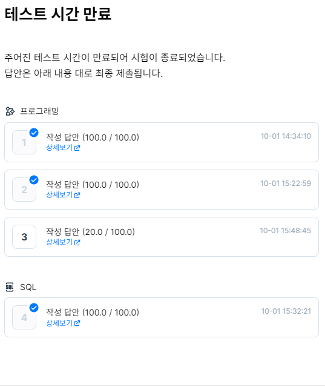

# 2022 Dev_matching Backend 하반기-1 코딩테스트 후기
## [1번문제](./dev1.py)
* 문제의 구현 자체는 쉬웠다. 하지만 완전탐색할 경우 무조건 시간초과가 뜨기에, 이분탐색, 해쉬, set등을 사용해 시간을 줄여야 했다. 해당 문제에서 나는 이분탐색을 사용해 풀었다.
## [2번문제](./dev2.py)
* 그래프 탐색문제이다. bfs를 사용해 그래프를 탐색해 이어진 땅의 각 알파벳들을 세어 딕셔너리로 저장하였다. 이후 문제에 조건에 맞게 승자를 판별해 땅을 몰아주었다.
## [3번문제](./dev3.py)
* 그리디 문제일까? 완전탐색 문제일까? 처음 접근은 product를 사용해 가능한 모든 숫자의 경우의 수를 만들고, 그 중 성냥의 개수가 일치하는 조합만을 세어주었다. 이 과정에서 몇 몇 케이스는 틀리고, 몇 몇 케이스는 시간 초과가 났다. 몇 몇 케이스가 틀린 이유는 0으로 시작하는 경우의 수들을 빼주지 않아서였다. 시간초과는 모든 경우의 수를 구하는게 아닌, 성냥개비 사용 개수만을 combination으로 구한 후 거기에 각 성냥개비 사용 개수로 만들 수 있는 숫자의 경우들을 곱해주어 구하려 했는데, 시간이 부족해 구현하지 못했다.
## [4번문제](./dev4.py)
* 기초적인 sql 문제였다.

## 결과

3.2솔. 3번도 아쉽게 풀지 못한걸 생각하면 푸는 속도를 늘리는 연습을 해야겠다.
