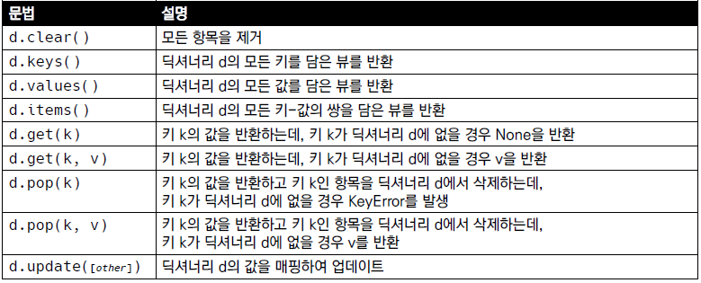

## 데이터 구조

### 시퀀스

#### 문자열

* 문자들의 나열
* 문자열은 작은 따옴표나 큰 따옴표를 활용하여 표기
* 문자열 탐색/검증

* 문자열 변경

#### 리스트

* 변경가능한 값들의 나열된 자료형
* 순서를 가지며, 서로 다른 타입의 요소를 가질 수 있음

### 컬렉션

#### 세트

* 유일한 값들의 모음
* 순서가 없고 중복된 값이 없음

#### 딕셔너리

* 키-값 쌍으로 이루어진 모음
  * 키 key : 불변 자료형만 가능
  * 값 values : 어떠한 형태든 관계 없음

