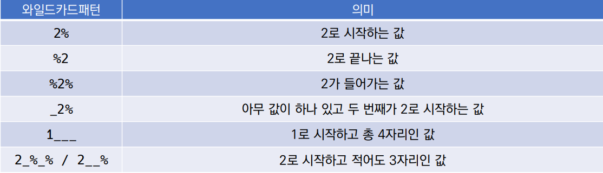

## WHERE

* 비교 연산자

  * =, >, >=, <, <= 는 숫자 혹은 문자 값의 대소, 동일 여부를 확인

* 논리 연산자

  * AND, OR, NOT

* SQL 사용 할 수 있는 연산자

  * BETWEEN 값1 AND 값2 : 값1이상 값2 이하

  * IN (값1, 값2...) : 목록 중에 값이 하나라도 일치하면 성공

  * LIKE : 비교문자열과 형태 일치, 와일드카드(%  : 0개 이상 문자, _ : 1개 단일 문자)

  * IS NULL, IS NOT NULL : NULL여부 확인 할 떄는 항상 '=' 대신에 'IS' 사용

  * 부정 연산자

    * 같지 않다 (!=, ^=, <>)

    * ~와 같지 않다 ( NOT 칼럼명 =)

    * ~보다 크지 않다 (NOT 칼럼명 >)

    * ```sqlite
      WHERE 칼럼명1 != 비교값1
      AND 칼럼명2 ^= 비교값2
      AND 칼럼명3 <> 비교값3
      AND NOT 칼럼명4 = 비교값4
      AND NOT 칼럼명5 > 비교값5; 
      ```

* 연산자 우선 순위

  1. 괄호 ()
  2. NOT
  3. 비교 연산자, SQL
  4. AND
  5. OR

### SQLite Aggregate Functions

* Aggregate function (집계 함수)

  * 값 집합에 대한 계산을 수행하고 단일 값을 반환

  * SELECT 구문에서만 사용

  * 예시

    * COUNT : 그룹의 항목 수

      * ```sql
        SELECT COUNT(컬럼) FROM 테이블이름;

    * AVG : 모든 값의 평균 계산

    * MAX : 그룹에 있는 모든 값의 최대값을 가져옴

    * MIN : 그룹에 있는 모든 값의 최소값을 가져옴

    * SUM : 모든 값의 합을 계산

      * ```sqlite
        -- 위 값들은 기본적으로 해당 컬럼이 숫자일 때만 사용 가능
        SELECT AVG(컬럼) FROM 테이블이름;
        SELECT SUM(컬럼) FROM 테이블이름;
        SELECT MIN(컬럼) FROM 테이블이름;
        SELECT MAX(컬럼) FROM 테이블이름;
        
        ```

### LIKE

* 패턴 일치를 기반으로 데이터를 조회하는 방법

* SQLite는 패턴 구성을 위한 2개의 wildcards를 제공 

  * % : 이 자리에 문자열이 있을 수도, 없을 수도 있다.
  * _ : 반드시 이 자리에 한 개의 문자가 존재해야 한다.
  * 

  * ```sqlite
    -- Q. users 테이블에서 이름이 ‘준’으로 끝나는 사람만 조회한다면?
    SELECT * FROM users WHERE first_name LIKE '%준';
    -- Q. users 테이블에서 중간 번호가 5114인 사람만 조회한다면?
    SELECT * FROM users WHERE phone LIKE '%-5114-%';
    ```

### ORDER BY

* 조회 결과 집합을 정렬

* SELECT 문에 추가하여 사용

* 정렬 순서를 위한 2개의 keyword 제공

  * ASC : 오름차순

  * DESC : 내림차순

  * ```sqlite
    SELECT * FROM 테이블이름 ORDER BY 컬럼 ASC;
    SELECT * FROM 테이블이름 ORDER BY 컬럼 DESC;
    ```