# Web

* 웹 사이트의 구성 요소

  * HTML > 구조

  * CSS > 표현

  * Jabascript > 동작
  * [예시 살펴보기](https://html-css-js.com/)
* 웹 사이트와 브라우저
  * 웹 사이트는 브라우저를 통해 동작함
  * 브라우저마다 동작이 약간씩 달라서 문제가 생기는 경우가 많음
  * 해결책으로 웹 표준이 등장

* 웹 표준
  * 웹에서 표준적으로 사용되는 기술이나 규칙
  * 어떤 브라우저든 웹 페이지가 동일하게 보이도록 함
  * 


## HTML 기초

### HTML?

* Hyper Text Markup Language
  * Markup Language
    * 태그 등을 이용하여 문서나 데이터의 구조를 명시하는 언어 : ex) HTML, Markdown
* 참조(하이퍼링크)를 통해 사용자가 한 문서에서 다른 문서로 즉시 접근할 수 있는 텍스트
* 웹 페이지를 작성(구조화) 하기 위한 언어

### HTML 기본 구조

* html : 문서의 최상위(root) 요소
* head : 문서 메타데이터 요소
  * 문서 제목, 인코딩, 스타일, 외부 파일 로딩 등
  * 일반적으로 브라우저에 나타나지 않는 내용
* body : 문서 본문 요소
  * 실제 화면 구성과 관련된 내용

* head 코드 예시

```html
<head> <!-- 문서 메타데이터 요소 -->
<title>HTML 수업</title> <!-- 브라우저 상단 타이틀 -->
<meta charset="UTF-8"> <!-- 문서 레벨 메타데이터 요소 -->
<link href="style.css" rel="stylesheet"> 
	<!-- 외부 리소스 연결 요소 (CSS파일, favicon 등) -->
<script src="javascript.js"></script> 
    <!-- 스크립트 요소(JavaScript 파일/코드) -->
<style> <!-- CSS 직접 작성 -->
p {
color: black;
}
</style>
</head>
```

* 요소(elemant)

  * 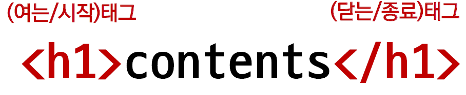

  * HTML 요소는 시작 태그와 종료 태그 그리고 태그 사이에 위치한 내용으로 구성
    * 요소는 태그로 컨텐츠(내용)를 감싸는 것으로 그 정보의 성격과 의미를 정의
    * 내용이 없는 태그들도 존재(닫는태그가없음) : br, hr, img, input, link, meta
  * 요소는 중첩(nested)될 수 있음
    * 요소의 중첩을 통해 하나의 문서를 구조화
    * 여는 태그와 닫는 태그의 쌍을 잘 확인해야함

* 속성(attribute)

  * 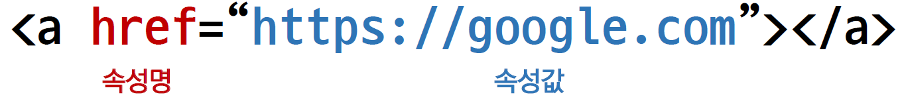

  * 공백x , 쌍따옴표 사용

  * 속성을 통해 태그의 부가적인 정보를 설정할 수 있음

  * 요소는 속성을 가질 수 있으며, 경로나 크기와 같은 추가적인 정보를 제공

  * 요소의 시작 태그에 작성하며 보통 이름과 값이 하나의 쌍으로 존재

  * 태그와 상관없이 사용 가능한 속성(HTML Global Attribute)들도 있음

    * 모든 HTML 요소가 공통으로 사용할 수 있는 대표적인 속성 (몇 몇 요소에는 아무 효과가 없을 수 있음)
      * ` id` : 문서 전체에서 유일한 고유 식별자 지정
      * ` class` : 공백으로 구분된 해당 요소의 클래스 목록(CSS, JS에서 요소를 선택하거나 접근)
      * ` data-*` : 페이지에 개인 사용자 정의  데이터를 저장하기 위해 사용
      * ` style` : inline 스타일
      * ` title` : 요소에 대한 추가 정보 지정
      * ` tabindex` : 요소의 탭 순서

  * ```html
    <!-- HTML 코드 예시 -->
    <!DOCTYPE html>
    <html lang="en">
    <head>
    <meta charset="UTF-8">
    <title>Document</title>
    </head>
    <body>
    <!-- 이것은 주석입니다. -->
    <h1>나의 첫번째 HTML</h1>
    <p>이것은 본문입니다.</p>
    <span>이것은 인라인요소</span>
    <a href="https://www.naver.com">네이버로 이동!!</a>
    </body>
    </html>
    ```

* 텍스트로 작성된 코드가 어떻게 웹 사이트가 되는 걸까?

  * 렌더링(Rendering) : 웹사이트코드를사용자가보게되는웹사이트로바꾸는과정

* DOM 트리

  * 텍스트 파일인 HTML 문서를 브라우저에서 렌더링 하기 위한 구조
    * HTML 문서에 대한 모델을 구성함
    * HTML 문서 내의 각 요소에 접근 / 수정에 필요한 프로퍼티와 메서드를 제공함
  * 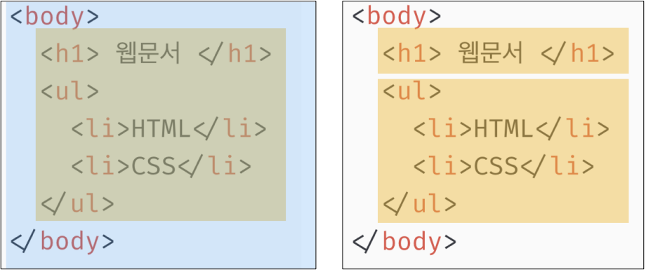

* 인라인 / 블록 요소

  * HTML 요소는 크게 인라인 / 블록 요소로 나눔
* 인라인 요소는 글자처럼 취급
  * 블록 요소는 한 줄 모두 사용
* 텍스트 요소
  
  * 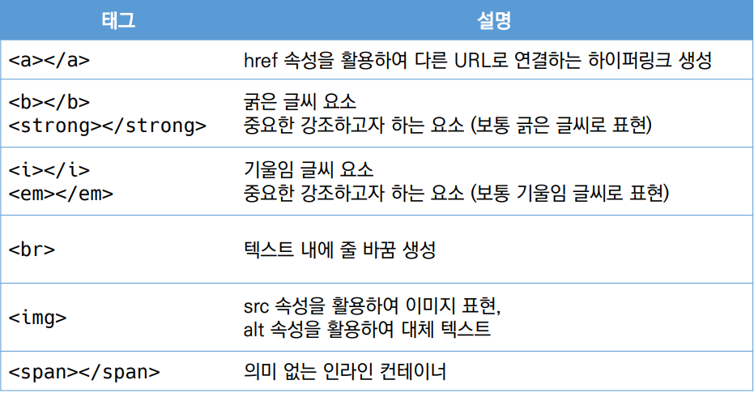
    * 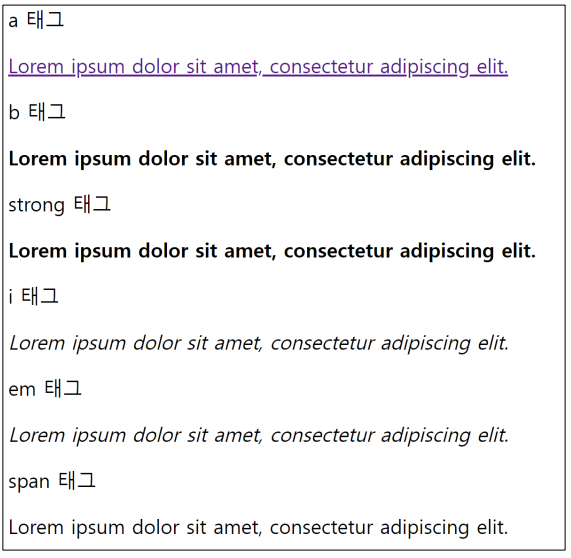
* 그룹 컨텐츠
  
    * 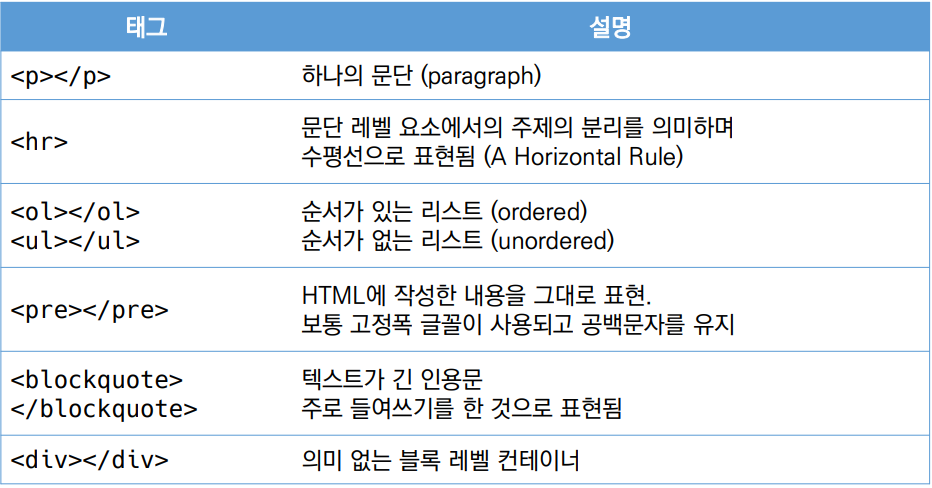
  * 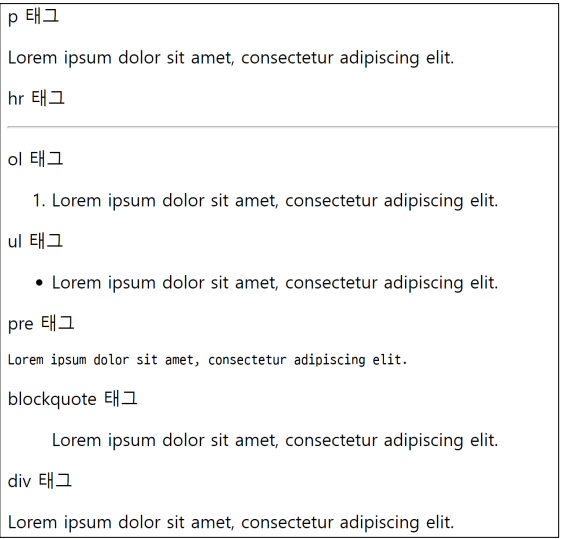
  * [실제 사용 예시](./01_html_기초.html)
* https://developer.mozilla.org/ko/docs/Web/HTML

## CSS 기초

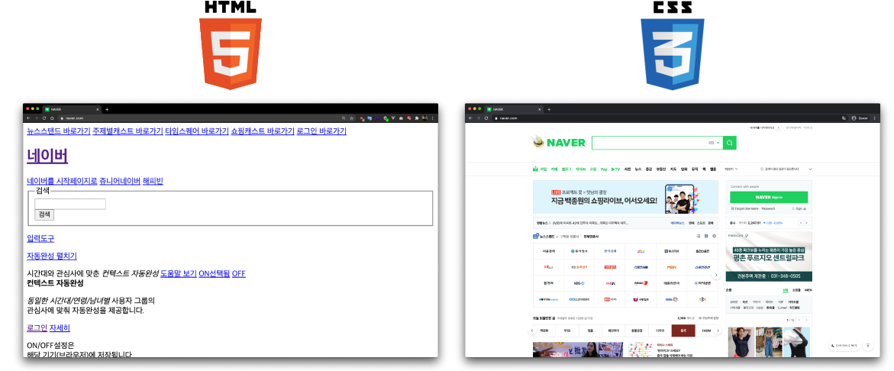

### CSS?

* Cascading Style Sheets

* 스타일을 지정하기 위한 언어
* 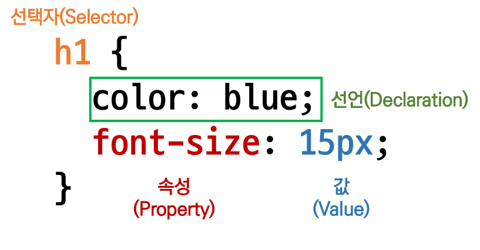
* CSS 구문은 선택자를 통해 스타일을 지정할 HTML 요소를 선택
* 중괄호 안에서는 속성과 값, 하나의 쌍으로 이루어진 선언을 진행
* 각 쌍은 선택한 요소의 속성, 속성에 부여할 값을 의미
  * 속성 (Property) : 어떤 스타일 기능을 변경할지 결정
  * 값 (Value) : 어떻게 스타일 기능을 변경할지 결정

### CSS 정의 방법

* 인라인

  * 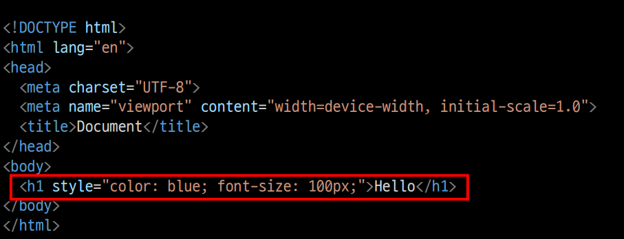

* 내부 참조

  * 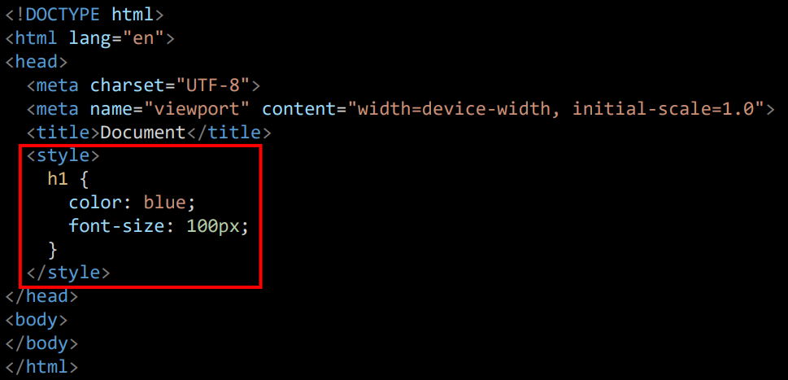

* 외부 참조

  * 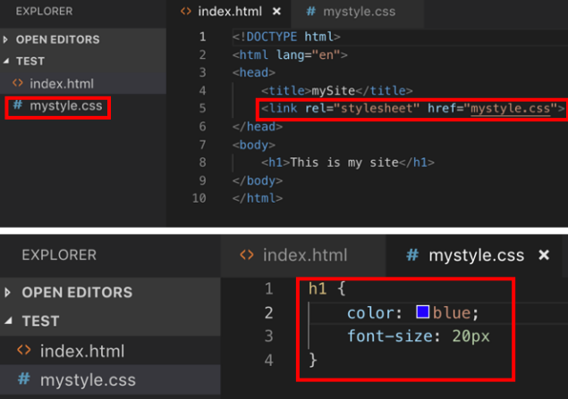

  * 외부 CSS파일을 ` <head>` 내 ` <link>`를 통해 불러오기

* CSS 기초 선택자

  * 요소 선택자 : HTML 태그를 직접 선택
  * 클래스(class) 선택자 : ` .`문자로 시작하며, 해당 클래스가 적용된 항목을 선택
  * 아이디(id) 선택자 : ` #` 문자로 시작하며, 해당 아이디가 적용된 항목을 선택한다. 일반적으로 하나의 문서에 한 번 사용하나 단일 id 사용을 권장한다.
* [css 사용해보기](./02_css.html)

* https://developer.mozilla.org/ko/docs/Web/CSS