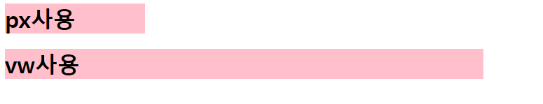

## CSS 기본 스타일

### 크기 단위

* px(픽셀)

  * 모니터 해상도의 한 화소인 '픽셀' 기준
  * 픽셀의 크기는 변하지 않기 때문에 고정적인 단위

* % 

  * 백분율 단위
  * 가변적인 레이아웃에서 자주 사용

* em

  * (바로 위, 부모 요소에 대한) 상속의 영향을 받음
  * 배수 단위, 요소에 지정된 사이즈에 상대적인 사이즈를 가짐

* rem

  * (바로 위, 부모 요소에 대한) 상속의 영향을 받지 않음
  * 최상위 요소(html)의 사이즈를 기준으로 배수 단위를 가짐

* 사용 예시

  * ``` html
    <!DOCTYPE html>
    <head>
        <title>연습</title>
        <style>
            .font-big {
            font-size: 36px;
            }
            .em {
            font-size: 2em;
            }
            .rem {
            font-size: 2rem;
            }
        </style>
    </head>
    <body>
        <ul class="font-big">
            <li class="em">2em</li>
            <li class="rem">2rem</li>
            <li>no class</li>
        </ul>
    </body>
    ```

  * 

### 크기단위 (viewport)

* 웹 페이지를 방문한 유저에게 바로 보이게 되는 웹 컨텐츠의 영역 (디바이스 화면)

* 디바이스 viewport를 기준으로 상대적인 사이즈가 결정됨

* 예) vw, vh, vmin, vmax

* 사용 예시

  * ```html
    <!DOCTYPE html>
        <head>
            <title>연습</title>
            <style>
                h1 {
                color: black;
                background-color: pink;
                }
                .px {
                width: 200px;
                }
                .vw {
                width: 50vw;
                }
            </style>
        </head>
        <body>
            <h1 class="px">px사용</h1>
            <h1 class="vw">vw사용</h1>
        </body>
    ```

  * 

  * 
    
    * vw는 상대적인 사이즈로 크기가 달라 질 수 있음

* 색상 키워드(background-color: red;)

  * 대소문자 구문 x
  * red, blue, black 과 같은 특정 색을 직접 글자로 나타냄

* RGB 색상(background-color: rgb(0, 255, 0);)

  * 16진수 표기법 혹은 함수형 표기법을 사용해서 특정 색을 표현하는 방식

* HSL 색상(background-color: hsl(0, 100%, 50%);)

  * 색상, 채도, 명도를 통해 특정 색을 표현하는 방식

* 사용 예시

  * ``` html
    p { color: black; }
    p { color: #000; }
    p { color: #000000; }
    p { color: rgb(0, 0, 0); }
    p { color: hsl(120, 100%, 0); }
    p { color: rgba(0, 0, 0, 0.5); }
    p { color: hsla(120, 100% 0.5);}
      <!-- 모두 black을 의마한다. a는 투명도 -->
    ```

### CSS 문서 표현

* 텍스트
  * 서체(font-family), 서체 스타일(font-style, font-weight 등)
  * 서체(font-family), 서체 스타일(font-style, font-weight 등)
* 컬러(color), 배경(background-image, background-color)
* 기타 HTML 태그별 스타일링
  * 목록(li), 표(table)

## CSS Selectors

### 선택자(Selector) 유형

* 기본 선택자
  * 전체 선택자, 요소 선택자
  * 클래스 선택자, 아이디 선택자, 속성 선택자
* 결합자(Combinators)
  * 자손 결합자, 자식 결합자
  * 일반 형제 결합자, 인접 형제 결합자
* 의사 클래스/요소(Pseudo Class)
  * 링크, 동적 의사 클래스
  * 구조적 의사 클래스, 기타 의사 클래스, 의사 엘리먼트, 속성 선택자

### CSS 선택자 정리

* 요소 선택자
  * HTML 태그를 직접 선택
* 클래스(class) 선택자
  *  ` .`문자로 시작하며, 해당 클래스가 적용된 항목을 선택
* 아이디(id) 선택자
  * 문자로 시작하며, 해당 아이디가 적용된 항목을 선택
  * 일반적으로 하나의 문서에 1번만 사용
  * 여러 번 사용해도 동작하지만, 단일 id를 사용하는 것을 권장

### CSS 적용 우선순위 (cascading order)

1. 중요도 (Importance) : 사용시 주의
   * !important
2.  우선 순위 (Specificity)
   * 인라인 > id > class, 속성, pseudo-class > 요소, pseudo-element
3. CSS 파일 로딩 순서

### CSS 상속

* CSS는 상속을 통해 부모 요소의 속성을 자식에게 상속한다.
  * 속성(프로퍼티) 중에는 상속이 되는 것과 되지 않는 것들이 있다.
  * 상속 되는 것 예시
    * Text 관련요소(font, color, text-align), opacity, visibility
  * 상속 되지 않는 것 예시
    * Box model 관련 요소(width, height, margin, padding, border, box-sizing, display), position 관련 요소(position, top/right/bottom/left, z-index) 등

## CSS Box model


### CSS 원칙 Ⅰ

모든 요소는 네모(박스모델)이고, 위에서부터 아래로, 왼쪽에서 오른쪽으로 쌓인다. (좌측 상단에 배치)

### Box model

* 모든 HTML 요소는 box 형태로 되어 있음

* 하나의 박스는 네 부분(영역)으로 이루어짐

  * margin
  * border
  * padding
  * content
  * 

  * 
  * 

* 사용 예시

  * ``` html
    <!DOCTYPE html>
        <head>
            <style>
                .box1 {
                width: 500px;
                border-width: 2px;
                border-color: black;
                border-style: dashed;
                padding-left: 50px;
                margin-bottom: 30px;
                }
                .box2 {
                width: 500px;
                border: 2px solid black;
                padding: 20px 30px;
                }
                </style>
        </head>
        <body>
            <div class="box1">div</div>
            <div class="box2">div</div>
        </body>
    ```

  * 

* Box sizing

  * ```html
    .box3 {
    width : 100px;
    margin : 10px auto;
    padding : 20px;
    border : 1px solid black;
    background-color: blueviolet;
    color: white;
    text-align: center;
    }
    .box-sizing {
    box-sizing: border-box;
    margin-top: 50px;
    }
    
    <div class="box3">content-box</div>
    <div class="box3 box-sizing">border-box</div>
    ```

    * 
    * 142px이 나옴

  * 
    * border-box 사용시 원하는 너비인 100px로 맞춰짐

* 기본적으로 모든 요소의 box-sizing은 content-box
  * Padding을 제외한 순수 contents영역만을 box로 지정
  * 다만, 우리가 보이는 영역의 너비를 100px로 보길 원할 때는 box-sizing을 border-box로 설정

* 

## CSS Display

### CSS 원칙 Ⅱ

* 모든 요소는 네모(박스모델)이고, 좌측 상단에 배치
* display에 따라 크기와 배치가 달라진다.

### 대표적으로 활용되는 display

* display : block
  * 줄 바꿈이 일어나는 요소
  * 화면 크기 전체의 가로 폭을 차지한다.
  * 블록 레벨 요소 안에 인라인 레벨 요소가 들어갈 수 있음.
* display : inline
  * 줄 바꿈이 일어나지 않는 행의 일부 요소
  * content 너비만큼 가로 폭을 차지한다.
  * width, height, margin-top, margin-bottom을 지정할 수 없다.

### 블록 레벨 요소와 인라인 레벨 요소

- 블록 레벨 요소와 인라인 레벨 요소 구분 (HTML 4.1까지)
- 대표적인 블록 레벨 요소 : div / ul, ol, li / p / hr / form 등
- 대표적인 인라인 레벨 요소 : span / a / img / input, label / b, em, i, strong 등
- block
  - 블록의 기본 너비는 가질 수 있는 너비의 100%
  - 너비를 가질 수 없다면 자동으로 부여되는 margin
- inline
  - inline의 기본 너비는 컨텐츠 영역만큼

### display

* display: inline-block
  * block과 inline 레벨 요소의 특징을 모두 가짐
  * • inline처럼 한 줄에 표시할 수 있고, block처럼 width, height, margin 속성을 모두 지정할 수 있음
* display: none
  * 해당 요소를 화면에 표시하지 않고, 공간조차 부여되지 않음
  * 이와 비슷한 visibility: hidden은 해당 요소가 공간은 차지하나 화면에 표시만 하지 않는다.

