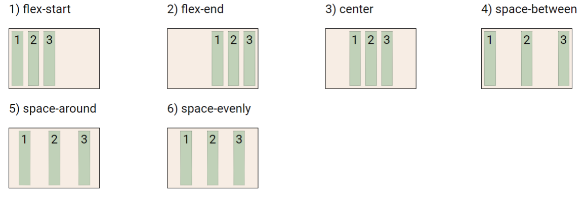
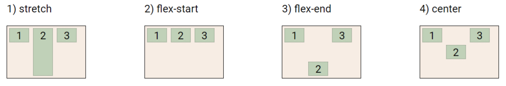

## CSS Position

* 문서 상에서 요소의 위치를 지정

* static : 모든 태그의 기본 값(기준 위치)

  * 일반적인 요소의 배치 순서에 따름(좌측 상단)
  * 부모 요소 내에서 배치될 때는 부모 요소의 위치를 기준으로 배치 됨
  * 

* 아래는 좌표 프로퍼티(top, bottom, left, right)를 사용하여 이동 가능

  1. relative : 상대 위치

     * 자기 자신의 static 위치를 기준으로 이동 (normal flow 유지)
     * 레아이웃에서 요소가 차지하는 공간은 static일 때와 같음 (normal position 대비 offset)
     * 

  2. absolute : 절대 위치

     * 요소를 일반적인 문서 흐름에서 제거 후 레이아웃에 공간을 차지하지 않음 ( normal flow에서 벗어나지 않음)

     * static이 아닌 가장 가까이 있는 부모/조상 요소를 기준으로 이동 (없는 경우 브라우저 화면 기준으로 이동)
     * 

     * [absolut vs relative 확인해보기](./00_index.html) : 형에게 ` top:100px`을 적용 했을 때 absolute와 relative의 차이를 알아보자
     * absolute는 normal flow에서 벗어남. 즉 다음 블록 요소가 좌측 상단으로 붙음.
     * relative는 normal flow 유지. 실제 위치는 그대로, 사람 눈에만 이동

  3. fixed : 고정 위치

     * 요소를 일반적인 문서 흐름에서 제거 후 레이아웃에 공간을 차지하지 않음 ( normal flow에서 벗어나지 않음)
     * 부모 요소와 관계 없이 viewport를 기준으로 이동, 스크롤 시에도 항상 같은 곳에 위치
     * 

  4. sticky : 스크롤에 따라 static > fixed로 변경

     * 속성을 적용한 박스는 평소에 문서 안에서 position: static 상태와 같이 일반적인 흐름에 따르지만 스크롤 위치가 임계점에 이르면 position: fixed와 같이 박스를 화면에 고정할 수 있는 속성
     * 일반적으로 Navigation Bar에서 사용됨. 

CSS 원칙 III

* position으로 위치의 기준을 변경 

  * relative : 본인의 원래 위치 

  * absolute : 특정 부모의 위치 
  *  fixed : 화면의 위치
  * sticky: 기본적으로 static이나 스크롤 이동에 따라 fixed로 변경

## CSS Layout

* CSS layout techniques
  * Display 
  * Position 
  * Float (CSS1, 1996) 
  * Flexbox (2012)
  *  Grid (2017)
  * 기타

### Float

* 박스를 왼쪽 혹은 오른쪽으로 이동시켜 텍스트를 포함 인라인요소들이 주변을 wrapping 하도록 함
* 요소가 Normal flow를 벗어나도록 함
* 

### Flexbox

* CSS Flexible Box Layout

  * 행과 열 형태로 아이템들을 배치하는 1차원 레이아웃 모델
  * 
  * Flex Container (부모 요소)
    * flexbox 레이아웃을 형성하는 가장 기본적인 모델
    * Flex Item들이 놓여있는 영역
    * display 속성을 flex 혹은 inline-flex로 지정
  *  Flex Item (자식 요소)
    * 컨테이너에 속해 있는 컨텐츠(박스)

* Flexbox를 사용해야 하는 이유

  * 이전까지는 수동 값 부여 없이는 수직정렬, 아이템의 너비와 높이 간격을 동일하게 배치하기가 어려웠다.
  * Flex를 통해 쉽게 가능

* 부모 요소에 display: flex 혹은 inline-flex 작성으로 시작

  * ```css
    .flex-container {
    display: flex;
    }
    ```

#### Flex 속성

* 배치 설정

  * flex-direction
    * Main axis 기준 방향 설정
    * 역방향의 경우 HTML 태그 선언 순서와 시각적으로 다르니 유의 (웹 접근성에 영향)
    * 
  * flex-wrap
    * 아이템이 컨테이너를 벗어나는 경우 해당 영역 내에 배치되도록 설정
    * 즉, 기본적으로 컨테이너 영역을 벗어나지 않도록 함
    * reverse도 가능
    * 
  * flex-flow
    * flex-direction 과 flex-wrap 의 shorthand
    * flex-direction과 flex-wrap에 대한 설정 값을 차례로 작성 ex) flex-flow: row nowrap;

* 공간 나누기

  * justify-content (main axis)

    * Main axis를 기준으로 공간 배분
    * 

  * align-content (cross axis)

    * Cross axis를 기준으로 공간 배분 (아이템이 한 줄로 배치되는 경우 확인할 수 없음)
    * 

  * 공간 배분

    * flex-start (기본 값) : 아이템들을 axis 시작점으로
    * flex-end : 아이템들을 axis 끝 쪽으로

    * center : 아이템들을 axis 중앙으로

    * space-between : 아이템 사이의 간격을 균일하게 분배

    * space-around : 아이템을 둘러싼 영역을 균일하게 분배 (가질 수 있는 영역을 반으로 나눠서 양쪽에)
    * space-evenly : 전체 영역에서 아이템 간 간격을 균일하게 분배

* 정렬

  * align-items (모든 아이템을 cross axis 기준으로)
    * 
  * align-self (개별 아이템에 적용)
    * 

* [연습해보기(Flexbox froggy)](https://flexboxfroggy.com/#ko)
* 참조 사이트들
  * [MDN](https://developer.mozilla.org/ko/docs/Web/CSS/CSS_Flexible_Box_Layout/Basic_Concepts_of_Flexbox)
  * [MDN](https://developer.mozilla.org/ko/docs/Learn/CSS/CSS_layout/Flexbox#%EC%99%9C_flexbox%EC%9D%B8%EA%B0%80)
  * [Learn CSS](https://web.dev/learn/css/the-cascade/)