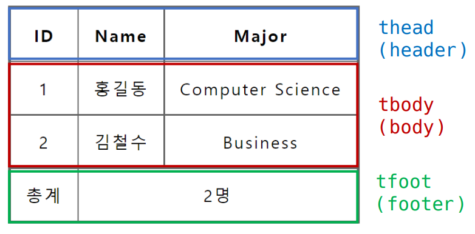
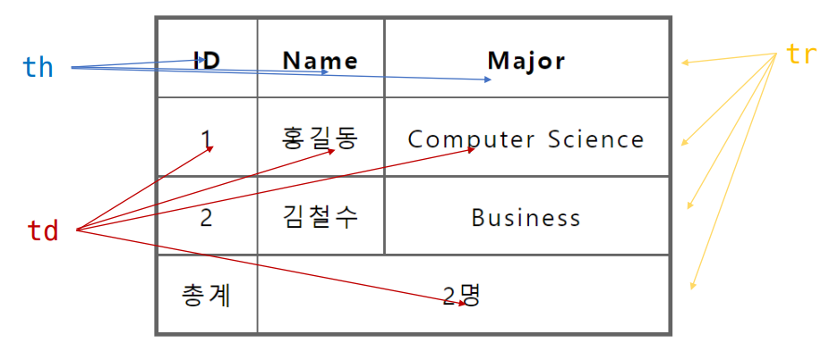
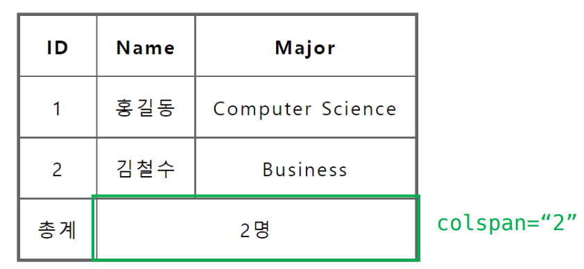
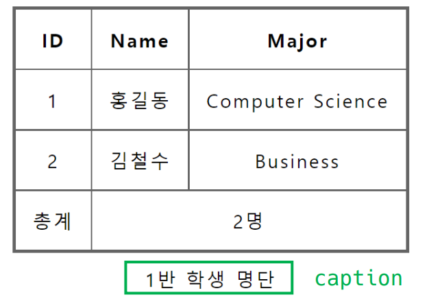
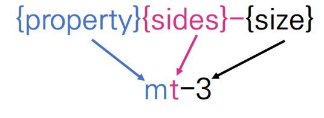
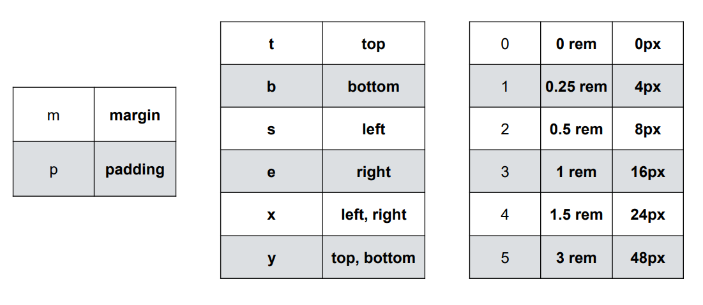
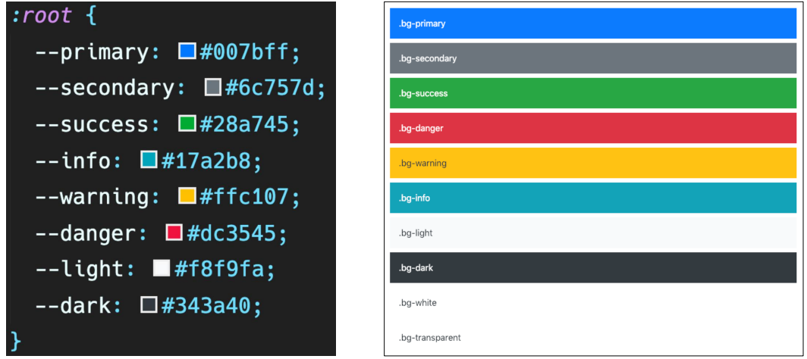
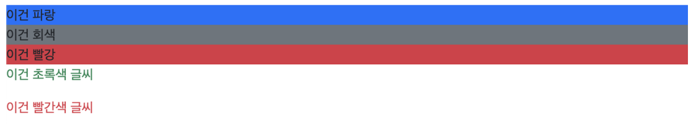
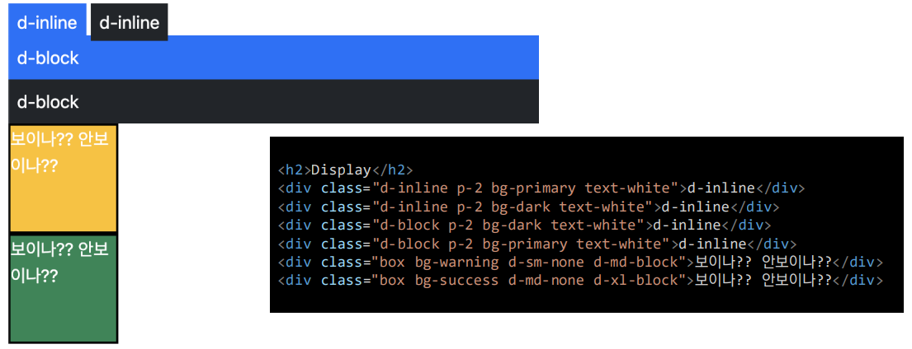

## HTML

### form

* table의 각 영역을 명시하기 위해    요소를 활용
* 
* ` <tr>`으로 가로 줄을 구성하고 내부에는 ` <th>`혹은 ` <td>`로 셀을 구성
* 
* colspan, rowspan 속성을 활용하여 셀 병합
* 
* caption을 통해 표 설명 또는 제목을 나타냄
* 


* table 태그 기본 구성
  * thead
    * tr > th
  * tbody
    * tr > td
  * tfoot
    * tr > td
  * caption

* ```html
  <body>
      <table>
          <thread>
          	<tr>
                  <th>ID</th>
                  <th>Name</th>
                  <th>Major</th>
              </tr>
          </thread>
          <tbody>
          	<tr>
              	<td>1</td>
                  <td>홍길동</td>
                  <td>Computer Science</td>
              </tr>
          	<tr>
              	<td>2</td>
                  <td>김철수</td>
                  <td>Business</td>
              </tr>
          </tbody>
          <tfoot>
          	<tr>
              	<td>총계</td>
                  <td colspan="2">2명</td>
              </tr>
          </tfoot>
      </table>
  </body>
  ```

* form

  * ` <form>`은 정보(데이터)를 서버에 제출하기 위해 사용하는 태그

  * ` <from>` 기본 속성

    * action : form을 처리할 서버의 URL(데이터를 보낼 곳)
    * method : from을 제출할 때 사용할 HTTP 메서드 (GET 혹은 POST)
    * enctype : method가 post인 경우 데이터의 유형
      * application/x-www-form-urlencoded : 기본값
      * multipart/form-data : 파일 전송시 (input type이 file인 경우)
      * text/plain : HTML5 디버깅 용 (잘 사용되지 않음)

  * ```html
    <form action="/search" method="GET">
    </form>
    ```

### input

* 다양한 타입을 가지는 입력 데이터 유형과 웨젯이 제공됨
* ` <input>`대표적인 속성
  * name : form control에 적용되는 이름 (이름/값 페어로 전송됨)
  * value : form control에 적용되는 값 (이름/값 페어로 전송됨)
  * required, readonly, autofocus, autocomplete, disabled 등

* ```html
  <form action="/search" method="GET">
  <input type="text" name="q">
  </form>
  ```

* input label

  * label을 클릭하여 input 자체의 초점을 맞추거나 활성화 시킬 수 있음

  * label과 input 입력의 관계가 시각적 뿐만 아니라 화면리더기에서도 label을 읽어 쉽게 내용을 확인 할 수 있도록 함

  * ` <input>`에 id속성을, `<label>`에는 for 속성을 활용하여 상호 연관을 시킴

  * ```html
    <label for="agreement">개인정보 수집에 동의합니다.</label>
    <input type="checkbox" name="agreement" id="agreement">
    ```

* [form 활용해보기](./00_form.html)

* input 유형 – 일반
  * 일반적으로 입력을 받기 위하여 제공되며 타입별로 HTML 기본 검증 혹은 추가 속성을 활용할수 있음
    * text : 일반 텍스트 입력
    * password : 입력 시 값이 보이지 않고 문자를 특수기호(*)로 표현
    * email : 이메일 형식이 아닌 경우 form 제출 불가
    * number : min, max, step 속성을 활용하여 숫자 범위 설정 가능
    * file : accept 속성을 활용하여 파일 타입 지정가능
* input 유형 - 항목 중 선택
  * 일반적으로 label 태그와 함께 사용하여 선택 항목을 작성함
  * 동일 항목에 대하여는 name을 지정하고 선택된 항목에 대한 value를 지정해야 함
    * checkbos : 다중선택
    * radio : 단일선택
  * 다양한 종류의 input을 위한 picker를 제공
    * color : color picker
    * date : date picker
  * hidden input을 활용하여 사용자 입력을 받지 않고 서버에 전송되어야 하는 값을 설정
    * hidden : 사용자에게 보이지 않는 input

## Bootstrap

### spacing

* spacing (Margin and padding)

* 

* ``` html
  <div class="mt-3 ms-5">bootstrap-spacing</div>
  ```

* 

### Color



* ```html
  <h2>Color</h2>
  <div class="bg-primary">이건 파랑</div>
  <div class="bg-secondary">이건 회색</div>
  <div class="bg-danger">이건 빨강</div>
  <p class="text-success">이건 초록색 글씨</p>
  <p class="text-danger">이건 빨간색 글씨</p>
  ```

* 

### Display




