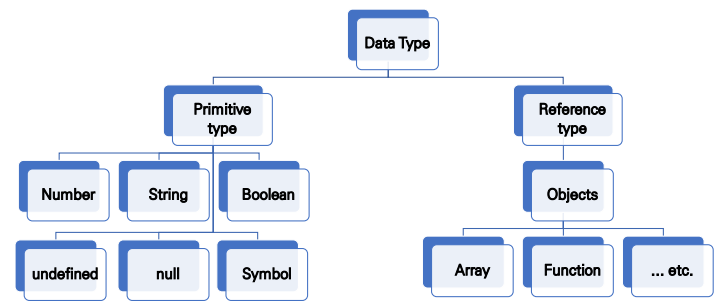

## 변수와 식별자

* 식별자(identifier)는 변수를 구분할 수 있는 변수명을 말함
* 식별자는 반드시 문자, 달러($) 또는 밑줄(_)로 시작
* 대소문자를 구분하며, 클래스명 외에는 모두 소문자로 시작
* 예약어* 사용 불가능 ex)  for, if, function 등
* 선언 (Declaration)  : 변수를 생성하는 행위 또는 시점
* 할당 (Assignment) : 선언된 변수에 값을 저장하는 행위 또는 시점
* 초기화 (Initialization) : 선언된 변수에 처음으로 값을 저장하는 행위 또는 시점

```javascript
let foo // 선언
console.log(foo)
foo = 11 // 할당
console.log(foo)
let bar = 0 // 선언 + 할당
comsole.log(bar)
```

### let, const

``` javascript
//let : 재할당 가능
let number = 1 //1. 선언 및 초기값 할당
nunber = 10 //2.재할당

console.long(number) //10
////////////////
//const : 재할당 불가능
const number = 1 //1. 선언 및 초기값 할당
number = 10 //2. 재할당 불가능

=> Error
////////////////

let number = 10 // 1. 선언 및 초기값 할당
let number = 50 // 2. 재선언 불가능
=>Error
const number = 10 // 1. 선언 및 초기값 할당
const number = 50 // 2. 재선언 불가능
=>Error

///////////////
// 블록 스코프 (block scope) : if, for, 함수 등의 중괄호 내부를 가리킴. 블록스코프를 가지는 변수는 블록 바깥에서 접근 불가능
let x = 1

if ( x === 1) {
    let x = 2
    console.log(x) // 2
}

console.log(x) // 1

```

### var

``` javascript
// var : 재할당 및 재할당 모두 가능
var number = 10 // 1. 선언 및 초기값 할당
var number = 50 // 2. 재할당

console.log(number) // 50
//////
// 함수 스코프
function foo() {
    var x = 5
    console.log(x) //5
}

```

* 호이스팅 되는 특성으로 예기치 못한 문제 발생 가능. 따라서 ES6 이후부터는 var 대신 const와 let 사용 권장

### 호이스팅 (hoisting)

* 변수를 선언 이전에 참조할 수 있는 현상
* 변수 선언 이전의 위치에서 접근 시 uindefined를 반환
* 자바스크립트는 모든 선언을 호이스팅한다.
* 즉 var, let, const 모두 호이스팅이 발생하지만, var는 선언과 초기화가 동시에 발상하여 일시적 사각지대가 존재하지 않는다.


## 데이터 타입

* 자바스크립트의 모든 값은 특정한 데이터 타입을 가짐
* 크게 원시 타입* (Primitive type)과 참조 타입* (Reference type)으로 분류됨



* 원시타입
  * 객체가 아닌 기본 타입
  * 변수에 해당 타입의 값이 담김
  * 다른 변수에 복사할 때 실제 값이 복사됨
* 참조 타입
  * 객체 (object) 타입의 자료형
  * 변수에 해당 객체의 참조 값이 담김
  * 다른 변수에 복사할 때 참조 값이 복사됨
* 숫자 (Number) 타입
  * 정수, 실수 구분 없는 하나의 숫자 타입 
  * 부동소수점 형식을 따름 
  * (참고) NaN (Not-A-Number)
* 문자열 (String) 타입
  * 텍스트 데이터를 나타내는 타입
  * 16비트 유니코드 문자의 집합 
  * 작은따옴표 또는 큰따옴표 모두 가능 
  * 템플릿 리터럴 (Template Literal)
    * 따옴표 대신 backtick()으로 표현 
    * ${ expression } 형태로 표현식 삽입 가능
* 그 외 undefined, null, Boolean 등 

### 연산자

* 할당 연산자	

  * 오른쪽에 있는 피연산자의 평가 결과를 왼쪽 피연산자에 할당하는 연산자 

  * 다양한 연산에 대한 단축 연산자 지원 
    * (참고) Increment 및 Decrement 연산자* 
      * Increment(++): 피연산자의 값을 1 증가시키는 연산자 
      * Decrement(--): 피연산자의 값을 1 감소시키는 연산자 
      * Airbnb Style Guide에서는 ‘+=’ 또는 ‘-=’와 같이 더 분명한 표현으로 적을 것을 권장

* 비교 연산자

  * 피연산자를 비교하고 결과값을 boolean으로 반환하는 연산자
  * 문자열은 유니코드 값을 사용하며 표준 사전 순서를 기반으로 비교

* 동등 비교 연산자 (==)

  * 두 피연산자가 같은 값으로 평가되는지 비교 후 boolean 값을 반환 
  * 비교할 때 암묵적 타입 변환을 통해 타입을 일치시킨 후 같은 값인지 비교 
  * 두 피연산자가 모두 객체일 경우 메모리의 같은 객체를 바라보는지 판별 
  * 예상치 못한 결과가 발생할 수 있으므로 특별한 경우를 제외하고 사용하지 않음

* 일치 비교 연산자 (===)

  * 두 피연산자가 같은 값으로 평가되는지 비교 후 boolean 값을 반환
  * 엄격한 비교*가 이뤄지며 암묵적 타입 변환이 발생하지 않음
    * 엄격한 비교 : 두 비교 대상의 타입과 값 모두 같은지 비교

* 논리 연산자

  * and 연산은 ‘&&’ 연산자를 이용 
  * or 연산은 ‘||’ 연산자를 이용 
  * not 연산은 ‘!’ 연산자를 이용

* 삼항 연산자 (Ternary Operator)

  * 세 개의 피연산자를 사용하여 조건에 따라 값을 반환하는 연산자 
  * 가장 왼쪽의 조건식이 참이면 콜론(:) 앞의 값을 사용하고 그렇지 않으면 콜론(:) 뒤의 값을 사용 
  * 삼항 연산자의 결과 값이기 때문에 변수에 할당 가능

### 조건문

* ` if` statement
  * 조건 표현식의 결과값을 Boolean 타입으로 변환 후 참/거짓을 판단
  * if, else if, else
    * 조건은 소괄호 안에 작성
    * 실행할 코드는 중괄호 안에 작성
    * 블록 스코프 생성
* ` switch` statement
  * 조건 표현식의 결과값이 어느 값(case)에 해당하는지 판별 
  * (참고*) 주로 특정 변수의 값에 따라 조건을 분기할 때 활용 
    * 조건이 많아질 경우 if문보다 가독성이 나을 수 있음
  * switch, case
    * 표현식의 결과값을 이용한 조건문
    * 표현식의 결과값과 case문의 오른쪽 값을 비교
    * break 및 default문은 선택적으로 사용 가능
    * break나 default문을 실행할 때 까지 다음 조건문 실행

### 반복문

* while
  * 조건문이 참인동안 반복 시행
  * 조건은 소괄호 안에 작성
  * 실행할 코드는 중괄호 안에 작성
  * 블록 스코프 생성
* for
  * 세미콜론(;)으로 구분되는 세 부분 으로 구성
  * initialization :  최초 반복문 진입 시 1회만 실행되는 부분
  * condition :  매 반복 시행 전 평가되는 부분
  * expression : 매 반복 시행 이후 평가되는 부분
  * 블록 스코프 생성
* for ... in
  * 객체(object)의 속성(key)들을 순회할 때 사용 
  * 배열도 순회 가능하지만 권장하지 않음 
  * 실행할 코드는 중괄호 안에 작성 
  * 블록 스코프 생성

* for...of 
  * 반복 가능한(iterable) 객체를 순회하며 값을 꺼낼 때 사용 
  * 실행할 코드는 중괄호 안에 작성 
  * 블록 스코프 생성

### 함수

* 참조 타입 중 하나로써 function 타입에 속함

* JavaScript에서 함수를 정의하는 방법은 주로 2가지로 구분 
  * 함수 선언식 (function declaration) 
  * 함수 표현식 (function expression)
* 함수의 정의
  * 함수의 이름과 함께 정의하는 방식
* 3가지 부분으로 구성
  * 함수의 이름 (name) 
  * 매개변수 (args) 
  * 함수 body (중괄호 내부)
* 함수 표현식(function expression)
  * 함수를 표현식 내에서 정의하는 방식
  * 함수의 이름을 생략하고 익명 함수로 정의 가능
  * 3가지 부분으로 구성
    * 함수의 이름 (생략 가능) 
    * 매개변수 (args) 
    * 몸통 (중괄호 내부)


* 함수의 타입
  * 선언식 함수와 표현식 함수 모두 타입은 function으로 동일
* 호이스팅(hoisting) – 함수 선언식
  * 함수 선언식으로 선언한 함수는 var로 정의한 변수처럼 hoisting 발생 
  * 함수 호출 이후에 선언 해도 동작
* 호이스팅(hoisting) - 함수 표현식
  * 반면 함수 표현식으로 선언한 함수는 함수 정의 전에 호출 시 에러 발생 
  * 함수 표현식으로 정의된 함수는 변수로 평가되어 변수의 scope 규칙을 따름

* 화살표 함수 (Arrow Function)

  * 함수를 비교적 간결하게 정의할 수 있는 문법 

  * function 키워드 생략 가능 

  * 함수의 매개변수가 단 하나 뿐이라면, ‘( )’ 도 생략 가능 

  * 함수 몸통이 표현식 하나라면 ‘{ }’과 return도 생략 가능 

  * 기존 function 키워드 사용 방식과의 차이점은 후반부 this 키워드를 학습하고 다시 설명

  * ```javascript
    const arrow1 = function (name) {
    return `hello, ${name}`
    }
    // 1. function 키워드 삭제
    const arrow2 = (name) => { return `hello, ${name}` }
    // 2. 매개변수가 1개일 경우에만 ( ) 생략 가능
    const arrow3 = name => { return `hello, ${name}` }
    // 3. 함수 바디가 return을 포함한 표현식 1개일 경우에 { } & return 삭제
    가능
    const arrow4 = name => `hello, ${name}`
    ```

### 문자열

* ` string.includes(value)` 
  * 문자열에 value가 존재하는지 판별 후 참 또는 거짓 반환
* `string.split(value)`
  * value가 없을 경우, 기존 문자열을 배열에 담아 반환 
  * value가 빈 문자열일 경우 각 문자로 나눈 배열을 반환 
  * value가 기타 문자열일 경우, 해당 문자열로 나눈 배열을 반환
* `string.replace(from, to)`
  * 문자열에 from 값이 존재할 경우, 1개만 to 값으로 교체하여 반환
* `string.replaceAll(from, to)`
  * 문자열에 from 값이 존재할 경우, 모두 to 값으로 교체하여 반환

* `string.trim()`
  * 문자열 시작과 끝의 모든 공백문자(스페이스, 탭, 엔터 등)를 제거한 문자열 반환
* `string.trimStart()`
  * 문자열 시작의 공백문자(스페이스, 탭, 엔터 등)를 제거한 문자열 반환
* `string.trimEnd()`
  * 문자열 끝의 공백문자(스페이스, 탭, 엔터 등)를 제거한 문자열 반환

### 배열

* 배열의 정의와 특징
  * 키와 속성들을 담고 있는 참조 타입의 객체(object) 
  * 순서를 보장하는 특징이 있음 
  * 주로 대괄호를 이용하여 생성하고, 0을 포함한 양의 정수 인덱스로 특정 값에 접근 가능 
  * 배열의 길이는 array.length 형태로 접근 가능
* `array.reverse()`
  * 원본 배열의 요소들의 순서를 반대로 정렬
* `array.push()`
  * 배열의 가장 뒤에 요소 추가
* `array.pop(`)
  * 배열의 마지막 요소 제거
* `array.unshift()`
  * 배열의 가장 앞에 요소 추가
* `array.shift()`
  * 배열의 첫번째 요소 제거
* `array.includes(value)`
  * 배열에 특정 값이 존재하는지 판별 후 참 또는 거짓 반환
* `array.indexOf(value)`
  * 배열에 특정 값이 존재하는지 확인 후 가장 첫 번째로 찾은 요소의 인덱스 반환
  * 만약 해당 값이 없을 경우 -1 반환

* `array.join([separator])`

  * 배열의 모든 요소를 연결하여 반환
  * separator(구분자)는 선택적으로 지정 가능하며, 생략 시 쉼표를 기본 값으로 사용

* spread operator(…)를 사용하면 배열 내부에서 배열 전개 가능

  * ```javascript
    const array = [1, 2, 3]
    const newArray = [0, ...array, 4]
    ```

* `array.forEach(callback(element[, index[,array]]))`

  * 배열의 각 요소에 대해 콜백 함수를 한 번씩 실행
  * 콜백 함수는 3가지 매개변수로 구성
    * element: 배열의 요소
    * index: 배열 요소의 인덱스 
    * array: 배열 자체
  * 반환 값(return)이 없는 메서드

* `array.map(callback(element[, index[, array]]))`

  * 배열의 각 요소에 대해 콜백 함수를 한 번씩 실행
  * 콜백 함수의 반환 값을 요소로 하는 새로운 배열 반환
  * 기존 배열 전체를 다른 형태로 바꿀 때 유용

* array.filter(callback(element[, index[, array]]))

  * 배열의 각 요소에 대해 콜백 함수를 한 번씩 실행
  * 콜백 함수의 반환 값이 참인 요소들만 모아서 새로운 배열을 반환
  * 기존 배열의 요소들을 필터링할 때 유용

* `array.reduce(callback(acc, element, [index[, array]])[, initialValue])`

  * 배열의 각 요소에 대해 콜백 함수를 한 번씩 실행
  * 콜백 함수의 반환 값들을 하나의 값(acc)에 누적 후 반환
  * reduce 메서드의 주요 매개변수
    * acc : 이전 callback 함수의 반환 값이 누적되는 변수
    * initialValue(optional) : 최초 callback 함수 호출 시 acc에 할당되는 값, default 값은 배열의 첫 번째 값
  * 빈 배열의 경우 initialValue를 제공하지 않으면 에러 발생

* `array.find(callback(element[, index[, array]]))`

  * 배열의 각 요소에 대해 콜백 함수를 한 번씩 실행
  * 콜백 함수의 반환 값이 참이면, 조건을 만족하는 첫번째 요소를 반환
  * 찾는 값이 배열에 없으면 undefined 반환

* `array.some(callback(element[, index[, array]]))`

  * 배열의 요소 중 하나라도 주어진 판별 함수를 통과하면 참을 반환
  * 모든 요소가 통과하지 못하면 거짓 반환
  * 빈 배열은 항상 거짓 반환

* `array.every(callback(element[, index[, array]]))`
  * 배열의 모든 요소가 주어진 판별 함수를 통과하면 참을 반환
  * 하나의 요소라도 통과하지 못하면 거짓 반환
  *  빈 배열은 항상 참 반환

### 객체

* 객체 정의와 특징
  * 객체는 속성(property)의 집합이며, 중괄호 내부에 key와 value의 쌍으로 표현
  * key는 문자열 타입*만 가능
    * key 이름에 띄어쓰기 등의 구분자가 있으면 따옴표로 묶어서 표현
  * value는 모든 타입(함수포함) 가능
  * 객체 요소 접근은 점 또는 대괄호로 가능
    * key 이름에 띄어쓰기 같은 구분자가 있으면 대괄호 접근만 가능
  * 메서드는 객체의 속성이 참조하는 함수
  * 객체.메서드명() 으로 호출 가능
  * 메서드 내부에서는 this 키워드가 객체를 의미함
* 객체 관련 ES6 문법 익히기
  * ES6에 새로 도입된 문법들로 객체 생성 및 조작에 유용하게 사용 가능
    * 속성명 축약 
    * 메서드명 축약 
    * 계산된 속성명 사용하기 
    * 구조 분해 할당
    * 객체 전개 구문(Spread Operator)
* JSON
  * key-value쌍의 형태로 데이터를 표기하는 언어 독립적 표준 포맷
  * 자바스크립트의 객체와 유사하게 생겼으나 실제로는 문자열 타입
    * 따라서 JS의 객체로써 조작하기 위해서는 구문 분석(parsing)이 필수
  * 자바스크립트에서는 JSON을 조작하기 위한 두 가지 내장 메서드를 제공
  * `JSON.parse() `: JSON => 자바스크립트 객체
  * `JSON.stringify()`: 자바스크립트 객체 => JSON