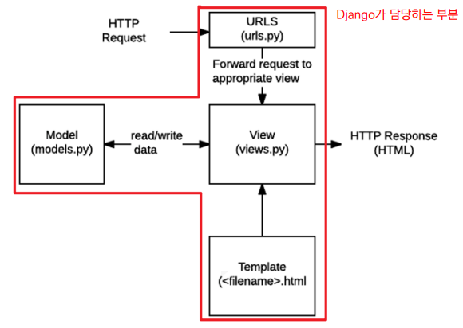
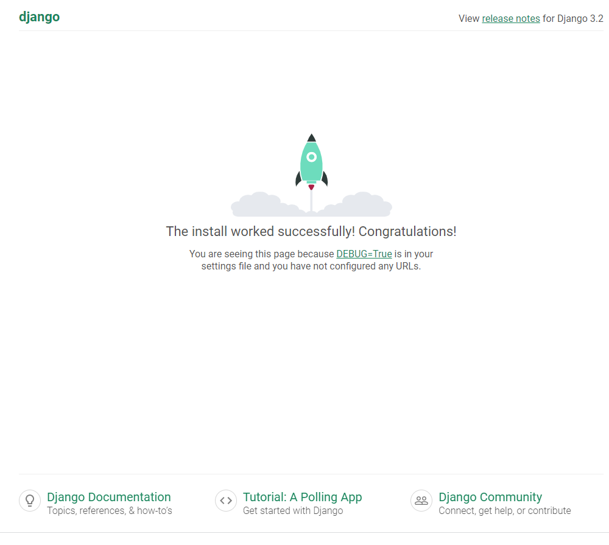

# Django 

## Django 시작하기

* Python도 익숙하고, HTML, CSS로 웹페이지도 구성 할 수 있다. 하지만 서버는?

* 웹 서비르 개발에는 너무 많은 기술들이 필요하다.
  * 잘 만들어진 것들을 가져다가 쓸 수 있는 세상! 
  * 프레임워크 사용

### Framework 이해하기

* 누군가 만들어 놓은 코드를 재사용 하는 것은 이미 익숙한 개발 문화
* 전 세계의 수많은 개발자들이 이미 수없이 많이 개발해 봤고, 그 과정에서 자주 사용되는 부분들을 재사용 할 수 있게 좋은 구조의 코드로 만들어 두 었음
* 그러한 코드들을 모아 놓은 것, 즉 서비스 개발에 필요한 기능들을 미리 구현해서 모아 놓은 것 = 프레임워크(Framework)
* “소프트웨어 프레임워크”는 복잡한 문제를 해결하거나 서술하는 데 사용되는 기본 개념 구조
* 따라서, Framework를 잘 사용하기만 하면 웹 서비스 개발에 있어서 모든 것들을 하나부터 열까지 직접 개발할 필요 없이, 내가 만들고자 하는 본질(로직)에 집중해 개발할 수 있음
* 소프트웨어의 생산성과 품질을 높임
* Django는?
  * Python으로 작성된 프레임워크 : Python이라는 언어의 강력함과 거대한 커뮤니티
  * 수많은 여러 유용한 기능들
  * 검증된 웹 프레임워크

### Django 구조 이해하기

* 소프트웨어 디자인 패턴
  * 수십년간 전 세계의 개발자들이 계속 만들다 보니 자주 사용되는 구조와 해결책이 있다는 것을 알게 됨
  * 앞서 배웠던 클라이언트-서버 구조도 소프트웨어 디자인 패턴 중 하나
  * 자주 사용되는 소프트웨어의 구조를 소수의 뛰어난 엔지니어가 마치 건축의 공법처럼 일반적인 구조화를 해둔 것
* Django에서의 디자인 패턴
  * Django에도 이러한 디자인 패턴이 적용이 되어 있는데, Django에 적용된 디자인 패턴은 MTV 패턴이다.
* MTV 디자인 패턴
  *  Model
    * 데이터와 관련된 로직을 관리 
    * 응용프로그램의 데이터 구조를 정의하고 데이터베이스의 기록을 관리
  * Template 
    * 레이아웃과 화면을 처리 
    * 화면상의 사용자 인터페이스 구조와 레이아웃을 정의
  * View 
  * Model & Template과 관련한 로직을 처리해서 응답을 반환 
  * 클라이언트의 요청에 대해 처리를 분기하는 역할 

* 

### Django Quick start

*  `pip install django==3.2.13`

  * 장고 설치 LTS버전(장기지원버전)인 3.2 설치

* `pip freeze > requirements.txt`

  * 패키지 목록 생성

* `django-admin startproject firstpjt .`

  * 프로젝트 생성

* ` python manage.py runserver`

  * 서버 실행

* 장고 설치중 이전 버전 설치 등의 문제로 충돌이 생길 시

  * ```bash
    $ find . -path "*/migrations/*.py" -not -name "__init__.py" -delete
    $ find . -path "*/migrations/*.pyc"  -delete
    
    #db.sqlite3 파일 삭제
    #django 다시 설치
    $ pip install --upgrade --force-reinstall Django==3.2.13
    #makemigrations 와 migrate 다시하기
    $ python manage.py makemigrations
    $ python manage.py migrate
    ```

* 

* 장고 실행 완료!