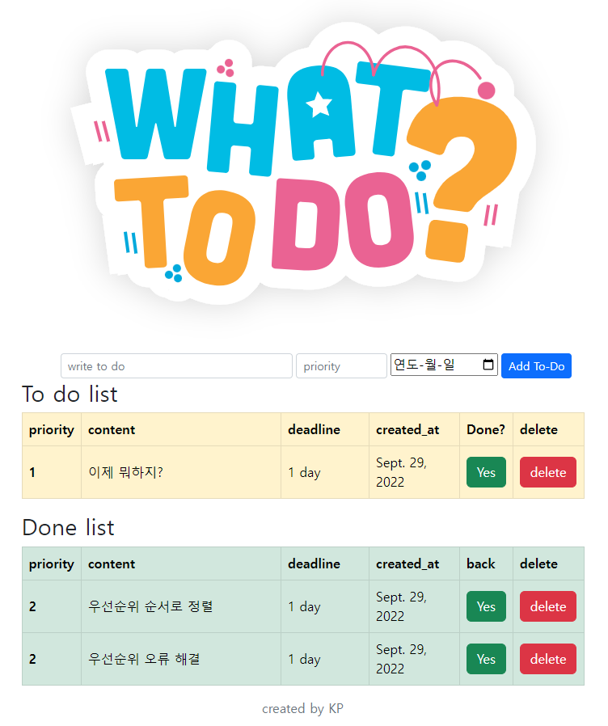

## Django day6 실습



### 기능

* write to do(text 최대 80자 입력), priority(버튼을 통해 1~9 값 입력), 날짜(달력을 통해 입력)를 입력받는다.
* `redirect`를 사용해 해당 페이지 아래 테이블에 추가한다.
* completed 버튼을 눌러 True<>False 변환 가능
* delete기능을 사용해 해당 데이터 삭제 가능

### 추가된 기능

* 내용, 우선순위, 날짜를 입력하지 않을 시 경고메세지
* completed의 값에 따라 서로 다른 테이블에 데이터 배치
* 데드라인을 입력한 데드라인 값 - 생성 날짜로 D데이로 표시

### urls.py

```python
from django.urls import path
from . import views

app_name = "todos"

urlpatterns = [
    path("", views.index, name="index"),
    path("create/", views.create, name="create"),
    path("delete/<todo_id>", views.delete, name="delete"),
    path("completed/<todo_id>", views.complete, name="completed"),
]

```

### views.py

```python
from django.shortcuts import render, redirect
from .models import Todo

# Create your views here.
def index(request):
    _todos = Todo.objects.all().order_by("priority")
    context = {
        "todos": _todos,
    }
    return render(request, "todos/index.html", context)


def create(request):
    content = request.GET.get("formcontent")
    priority = request.GET.get("formpriority")
    deadline = request.GET.get("formdate")
    Todo.objects.create(content=content, priority=priority, deadline=deadline)
    return redirect("todos:index")


def delete(request, todo_id):
    todo = Todo.objects.get(id=todo_id)
    todo.delete()
    return redirect("todos:index")


def complete(request, todo_id):
    todo = Todo.objects.get(id=todo_id)
    todo.completed = not todo.completed
    todo.save()
    return redirect("todos:index")
```

### templates

```django



<div class="container d-flex justify-content-center flex-column">
    
    <form class="row g-1 d-flex justify-content-center" action="">
        <div class="col-5">
            <input class="form-control form-control-sm" type="text" name="formcontent" id="todotext" maxlength="80"
                placeholder="write to do" required>
        </div>
        <div class="col-2">
            <input class="form-control form-control-sm" type="number" name="formpriority" id="todopriority"
                maxlength="1" max="9" min="1" placeholder="priority" required>
        </div>
        <div class="col-auto" type="date">
            <input type="date" placeholder="deadline" name="formdate" required>
        </div>
        <div class="col-1">
            <input class="btn btn-primary btn-sm" type="submit" value="Add To-Do">
        </div>
    </form>
    <h2>To do list</h2>
    <table class="table table-warning table-bordered">
        <thead>
            <tr>
                <th scope="col">priority</th>
                <th scope="col">content</th>
                <th scope="col">deadline</th>
                <th scope="col">created_at</th>
                <th scope="col">Done?</th>
                <th scope="col">delete</th>
            </tr>
        </thead>
        <tbody>
            
            
            <tr>
                <th scope="row" class="align-middle col-1">{{ todo.priority }}</th>
                <td class="align-middle col-5">{{ todo.content }}</td>
                <td class="align-middle col-2">{{ todo.deadline|timeuntil:todo.created_at }}</td>
                <td class="align-middle col-2">{{ todo.created_at }}</td>
                <td class="align-middle col-1">
                    <a class="btn btn-success" href="">
                        Yes
                    </a>
                </td>
                <td class="align-middle col-1"><a class="btn btn-danger"
                        href="">delete</a>
                </td>
            </tr>
            
            
        </tbody>
    </table>
    <h2>Done list</h2>
    <table class="table table-success table-bordered">
        <thead>
            <tr>
                <th scope="col">priority</th>
                <th scope="col">content</th>
                <th scope="col">deadline</th>
                <th scope="col">created_at</th>
                <th scope="col">back</th>
                <th scope="col">delete</th>
            </tr>
        </thead>
        <tbody>
            
            
            <tr>
                <th scope="row" class="align-middle col-1">{{ todo.priority }}</th>
                <td class="align-middle col-5">{{ todo.content }}</td>
                <td class="align-middle col-2">{{ todo.deadline|timeuntil:todo.created_at }}</td>
                <td class="align-middle col-2">{{ todo.created_at }}</td>
                <td class="align-middle col-1">
                    <a class="btn btn-success" href="">
                        Yes
                    </a>
                </td>
                <td class="align-middle col-1"><a class="btn btn-danger"
                        href="">delete</a>
                </td>
            </tr>
            
            
        </tbody>
    </table>
</div>
<footer class="text-center pb-3 text-secondary">created by KP</footer>

```

### models.py

```python
from email.policy import default
from django.db import models

# Create your models here.


class Todo(models.Model):
    content = models.CharField(max_length=80)
    completed = models.BooleanField(default=False)
    priority = models.IntegerField(default=3)
    created_at = models.DateField(auto_now_add=True)
    deadline = models.DateField(null=True)
```

