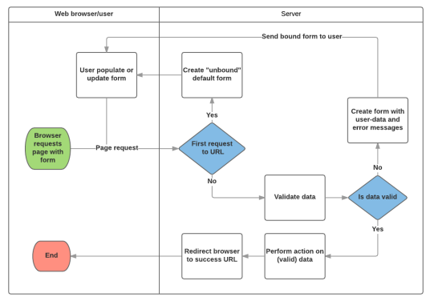

## Django ModelForm

* DB 기반의 어플리케이션을 개발하다보면, HTML Form(UI)은 Django의 모델(DB)과 매우 밀접한 관계를 가지게 됨. 
  * 사용자로부터 값을 받아 DB에 저장하여 활용하기 때문 
  * 즉, 모델에 정의한 필드의 구성 및 종류에 따라 HTML Form이 결정됨
* 사용자가 입력한 값이 DB의 데이터 형식과 일치하는지를 확인하는 유효성 검증이 반드시 필요하며 이는 서버 사이드에서 반드시 처리해야 함.

### ModelForm Class

* Model을 통해 Form Class를 만들 수 있는 helper class 
* ModelForm은 Form과 똑같은 방식으로 View 함수에서 사용

### ModelForm 선언

* forms 라이브러리의 ModelForm 클래스를 상속받음 

* 정의한 ModelForm 클래스 안에 Meta 클래스를 선언 

* 어떤 모델을 기반으로 form을 작성할 것인지에 대한 정보를 Meta 클래스에 지정

* ```python
  # articles/forms.py
  from django import forms
  from .models import Article
  class ArticleForm(forms.ModelForm):
  	class Meta:
  		model = Article
  		fields = '__all__'
  ```

### ModelForm에서의 Meta Class 

* ModelForm의 정보를 작성하는 곳 
* ModelForm을 사용할 경우 참조 할 모델이 있어야 하는데, Meta class의 model 속성이 이를 구성함
  * 참조하는 모델에 정의된 field 정보를 Form에 적용함
* fields 속성에 `__all__`를 사용하여 모델의 모든 필드를 포함할 수 있음 
* 또는 exclude 속성을 사용하여 모델에서 포함하지 않을 필드를 지정할 수 있음

* ```python
  # articles/forms.py
  class ArticleForm(forms.ModelForm):
  	class Meta:
  		model = Article
  		exclude = ('title',)
  ```

### ModelForm의 활용

*  ModelForm 객체를 context로 전달

* ```python
  # articles/views.py
  from .forms import ArticleForm
  
  def new(request):
      form = ArticleForm()
      context = {
      'form': form,
      }
      return render(request, 'articles/new.html', context)
  ```

* Input Field 활용

* ```python
  <!-- articles/new.html -->
  
  
      <h1>NEW</h1>
          <form action="" method="POST">
          
          {{ form.as_p }}
          <input type="submit">
      </form>
      <hr>
      <a href= "">[back]</a>
  
  ```

### From rendering options

* `<label>` & `<input>` 쌍에 대한 3가지 출력 옵션
  * `as_p()` : 각 필드가 단락(`<p>` 태그)으로 감싸져서 렌더링 
  * `as_ul()` : 각 필드가 목록 항목(`<li>`태그)으로 감싸져서 렌더링, `<ul>` 태그는 직접 작성해야 한다.
  * `as_table()` :각 필드가 테이블(`<tr>` 태그) 행으로 감싸져서 렌더링

## ModelForm with view functions

### ModelForm 활용 로직

* 요청 방식에 따른 분기 
  * HTML Form 전달 
  * 사용자 입력 데이터 수신 
* 유효성 검사에 따른 분기 
  * 유효성 검사 실패시 Form으로 전달 
  * 유효성 검사 성공시 DB 저장



### CREATE

* 유효성 검사를 통과하면 데이터 저장 후 상세 페이지로 리다이렉트

* 통과하지 못하면 작성 페이지로 리다이렉트

* ```python
  # articles/views.py
  def create(request):
  form = ArticleForm(request.POST)
      if form.is_valid():
      	article = form.save()
      	return redirect('articles:detail', article.pk)
  return redirect('articles:new')
  ```

#### `is_valid()` method

* 유효성 검사를 실행하고, 데이터가 유효한지 여부를 boolean으로 반환 
* 데이터 유효성 검사를 보장하기 위한 많은 테스트에 대해 Django는 `is_valid()`를 제공하여 개발자의 편의를 도움

####  `save()` method

* form 인스턴스에 바인딩 된 데이터를 통해 데이터베이스 객체를 만들고 저장 

* ModelForm의 하위 클래스는 키워드 인자 instance 여부를 통해 생성할 지, 수정할 지를 결정함 

  * 제공되지 않은 경우 `save()`는 지정된 모델의 새 인스턴스를 만듦(CREATE) 
  * 제공되면 `save()`는 해당 인스턴스를 수정(UPDATE)

* ```python
  # CREATE
  form = ArticleForm(request.POST)
  form.save()
  # UPDATE
  form = ArticleForm(request.POST, instance=article)
  form.save()
  ```

#### form 인스턴스의 errors 속성

* `is_valid()`의 반환 값이 False인 경우 form 인스턴스의 errors 속성에 값이 작성되는데, 유효성 검증을 실패한 원인이 딕셔너리 형태로 저장됨

* 이 같은 특징을 통해 다음과 같은 구조로 코드를 작성하면 유효성 검증을 실패 했을 때 사용자에게 실패 결과 메세지를 출력해줄 수 있음

* ```python
  # articles/views.py
  def create(request):
      form = ArticleForm(request.POST)
      if form.is_valid():
          article = form.save()
          return redirect('articles:detail', article.pk)
      context = {
      'form': form,
      }
  	return render(request, 'articles/new.html', context)
  ```

### UPDATE

* ModelForm의 인자 instance는 수정 대상이 되는 객체(기존 객체)를 지정 

* `request.POST` : 사용자가 form을 통해 전송한 데이터 (새로운 데이터) 

* instance : 수정이 되는 대상

* edit – view 수정

* ```python
  # articles/views.py
  def edit(request, pk):
      article = Article.objects.get(pk=pk)
      form = ArticleForm(instance=article)
      context = {
          'article': article,
          'form': form,
      }
      return render(request, 'articles/edit.html', context)
  ```

* edit - template 수정

* ```django
  <!– articles/edit.html -->
  
  
      <h1>EDIT</h1>
      <form action="" method="POST">
          
          {{ form.as_p }}
          <input type="submit">
  	</form>
      <hr>
      <a href="">[back]</a>
  
  ```

* update - view 수정

* ```python
  # articles/views.py
  def update(request, pk):
      article = Article.objects.get(pk=pk)
      form = ArticleForm(request.POST, instance=article)
          if form.is_valid():
          form.save()
          return redirect('articles:detail', article.pk)
      context = {
      'form': form,
      'article': article,
      }
      return render(request, 'articles/edit.html', context)
  ```

## Handling HTTP requests

### Create

* new와 create view 함수를 합침 

* 각각의 역할은 `request.method` 값을 기준으로 나뉨

* ```python
  # articles/views.py
  def create(request):
      if request.method == 'POST':
          form = ArticleForm(request.POST)
          if form.is_valid():
              article = form.save()
              return redirect('articles:detail', article.pk)
      else:
      	form = ArticleForm()
      context = {
      	'form': form,
      }
      return render(request, 'articles/new.html', context)
  ```

* 이제는 불필요해진 new의 view 함수와 url path를 삭제

* new.html → create.html 이름변경 및 action 속성 값 수정

* new.html → create.html 이름변경으로 인한 템플릿 경로 수정

* index 페이지에 있던 new 관련 링크 수정

### Update

* edit과 update view 함수를 합침

* ```python
  # articles/views.py
  def update(request, pk):
      article = Article.objects.get(pk=pk)
      if request.method == 'POST':
          form = ArticleForm(request.POST, instance=article)
          if form.is_valid():
              form.save()
              return redirect('articles:detail', article.pk)
      else:
      	form = ArticleForm(instance=article)
      context = {
          'form': form,
          'article': article,
      }
      return render(request'articles/updatehtml'context)
  ```

* new와 마찬가지로 불필요해진 edit의 view 함수와 url path를 삭제

* edit.html → update.html 이름변경으로 인한 관련 정보 수정

## Admin site

* Django의 가장 강력한 기능 중 하나인 automatic admin interface 알아보기

* “관리자 페이지” 

  * 사용자가 아닌 서버의 관리자가 활용하기 위한 페이지 
  * 모델 class를 admin.py에 등록하고 관리 
  * 레코드 생성 여부 확인에 매우 유용하며 직접 레코드를 삽입할 수도 있음

* admin 계정 생성

  * `$ python manage.py createsuperuser`
  * username과 password를 입력해 관리자 계정을 생성

* admin site 로그인

  * http://127.0.0.1:8000/admin/ 로 접속 후 로그인 
  * 계정만 만든 경우 Django 관리자 화면에서 모델 클래스는 보이지 않음

* admin에 모델 클래스 등록

  * 모델의 record를 보기 위해서는 admin.py에 등록 필요

  * ```python
    # articles/admin.py
    from django.contrib import admin
    from .models import Article
    
    admin.site.register(Article)
    ```

* 등록된 모델 클래스 확인

* 데이터 CRUD 테스트
  * admin 페이지에서 데이터를 조작해보기

## Static files

* 웹 서버는 특정 위치(URL)에 있는 자원(resource)을 요청(HTTP request) 받아서 제공(serving)하는 응답(HTTP response)을 처리하는 것을 기본 동작으로 함 
* 즉, 웹 서버는 요청 받은 URL로 서버에 존재하는 정적 자원(static resource)를 제공

### 정적 파일

* 응답할 때 별도의 처리 없이 파일 내용을 그대로 보여주면 되는 파일 
  * 사용자의 요청에 따라 내용이 바뀌는 것이 아니라 요청한 것을 그대로 보여주는 파일 
* 예를 들어, 웹 서버는 일반적으로 이미지, 자바 스크립트 또는 CSS와 같은 미리 준비된 추가 파일(움직이지 않는)을 제공해야 함 
* 파일 자체가 고정되어 있고, 서비스 중에도 추가되거나 변경되지 않고 고정되어 있음 
* Django에서는 이러한 파일들을 “Static file”이라 함 
  * Django는 staticfiles 앱을 통해 정적 파일과 관련 된 기능을 제공
* `django.contrib.staticfiles`가 INSTALLED_APPS에 포함되어 있는지 확인 
* settings.py에서 STATIC_URL을 정의 
* 템플릿에서 static 템플릿 태그를 사용하여 지정된 상대경로에 대한 URL을 빌드 
* 앱의 static 디렉토리에 정적 파일을 저장 
  * 예시) my_app/static/my_app/example.jpg
* STATICFILES_DIRS
  * ‘app/static/’ 디렉토리 경로(기본 경로) 를 사용하는 것외에 추가적인 정적 파일 경로 목록을 정의하는 리스트 
  * 추가 파일 디렉토리에 대한 전체 경로를 포함하는 문자열 목록으로 작성되어야 함
* STATIC_URL 
  * STATIC_ROOT에 있는 정적 파일을 참조 할 때 사용할 URL 
  * 개발 단계에서는 실제 정적 파일들이 저장되어 있는 ‘app/static/’ 경로(기본 경로) 및 STATICFILES_DIRS에 정의된 추가 경로들을 탐색함 
  * 실제 파일이나 디렉토리가 아니며, URL로만 존재 
  * 비어 있지 않은 값으로 설정 한다면 반드시 slash(/)로 끝나야 함
* STATIC_ROOT 
  * collectstatic이 배포를 위해 정적 파일을 수집하는 디렉토리의 절대 경로 
  * django 프로젝트에서 사용하는 모든 정적 파일을 한 곳에 모아 넣는 경로 
  * 개발 과정에서 settings.py의 DEBUG 값이 True로 설정되어 있으면 해당 값은 작용되지 않음 
  * 직접 작성하지 않으면 django 프로젝트에서는 settings.py에 작성되어 있지 않음 
  * 실 서비스 환경(배포 환경)에서 django의 모든 정적 파일을 다른 웹 서버가 직접 제공하기 위함
*  collectstatic
  * `STATIC_ROOT = BASE_DIR / 'staticfiles'`
  * `$python manage.py collectstatic`

* load

  * 사용자 정의 템플릿 태그 세트를 로드(load) 
  * 로드하는 라이브러리, 패키지에 등록된 모든 태그와 필터를 불러옴

* static 

  * STATIC_ROOT에 저장된 정적 파일에 연결

* ```django
  
  <img scr="" alt="My image"
  ```

### 정적 파일 사용하기

* 기본 경로
* 

* 추가 경로
* 
* STATIC_URL 확인
* 