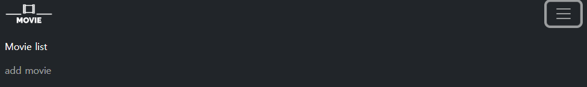
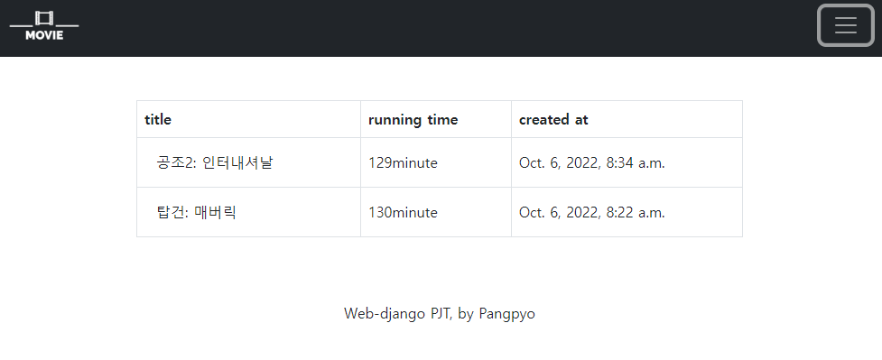
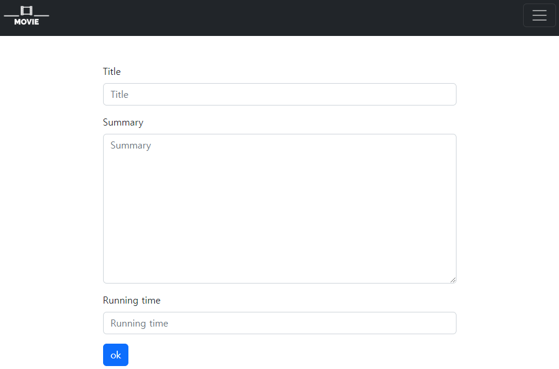
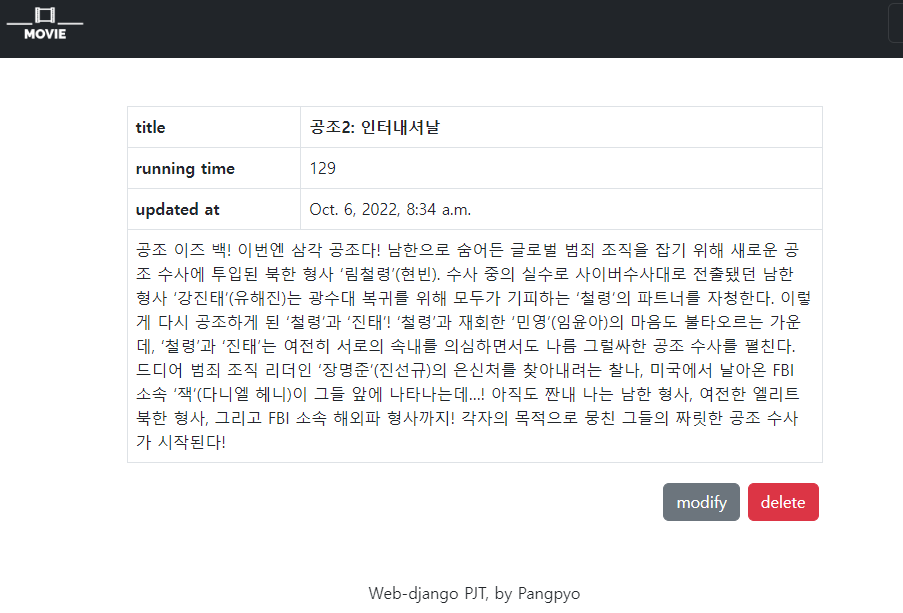
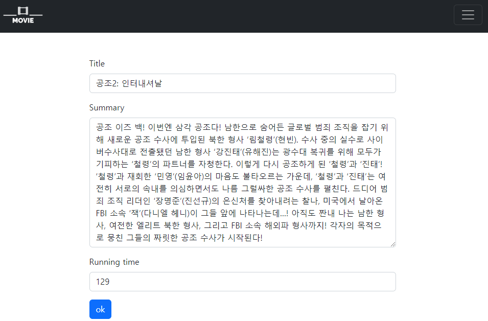

# Django 영화 정보 페이지 만들기 실습

## [base.html](./pjt/templates/base.html)





네비게이션 바 및 푸터를 만들었고, 기본 장고 부트스트랩을 load했다. 앞으로의 페이지에 베이스 템플릿으로 쓰일 것이다. 로고나 Movie list는 index.html로 연결되고, add moive는 create.html로 연결된다.

## Index page



각 영화의 타이틀 클릭시 detail.html로 넘어간다.

### movie/urls.py

```python
urlpatterns = [
    path("", views.index, name="index"),
]
```

### movie/views.py

```python
from django.shortcuts import render, redirect
from .models import Movies
from .forms import MoiveForm
# Create your views here.

def index(request):
    movies = Movies.objects.order_by("-pk")
    context = {
        "movies": movies,
    }
    return render(request, "movie/index.html", context)
```

###  [index.html](./pjt/movie/templates/movie/index.html)

## Create



제목, 내용, 러닝타임을 입력 할 수 있다.

### movie/urls.py

```python
urlpatterns = [
    path("", views.index, name="index"),
    path("create/", views.create, name="create"),
]
```

### movie/views.py

```python
def create(request):
    if request.method == "POST":
        movie_form = MoiveForm(request.POST)
        if movie_form.is_valid():
            movie_form.save()
            return redirect("movie:index")
    else:
        movie_form = MoiveForm()
    context = {
        "movie_form": movie_form,
    }
    return render(request, "movie/create.html", context=context)
```

### [create.html](./pjt/movie/templates/movie/create.html)

해당 html파일은 이후 업데이트때도 동일하게 쓰인다.

## Read



디테일 페이지. 제목, 러닝타임, 최종 수정일, 내용 등 상세한 내용을 볼 수 있으며 수정, 삭제가 가능하다.

### movie/urls.py

```python
urlpatterns = [
    path("", views.index, name="index"),
    path("create/", views.create, name="create"),
    path("detail/<int:pk>", views.detail, name="detail"),
]
```

### movie/views.py

```python
def detail(request, pk):
    movie = Movies.objects.get(pk=pk)
    context = {
        "movie": movie,
    }
    return render(request, "movie/detail.html", context)
```

### [detail.html](./pjt/movie/templates/movie/detail.html)

## Update



해당 글의 제목과 내용들을 수정 할 수 있다.

### movie/urls.py

```python
urlpatterns = [
    path("", views.index, name="index"),
    path("create/", views.create, name="create"),
    path("detail/<int:pk>", views.detail, name="detail"),
    path("update/<int:pk>", views.update, name="update"),
]
```

### movie/views.py

```python
def update(request, pk):
    movie = Movies.objects.get(pk=pk)
    if request.method == "POST":
        movie_form = MoiveForm(request.POST, instance=movie)
        if movie_form.is_valid():
            movie_form.save()
            return redirect("movie:detail", movie.pk)
    else:
        movie_form = MoiveForm(instance=movie)
    context = {
        "movie_form": movie_form,
        "movie": movie,
    }
    return render(request, "movie/create.html", context)
```

### [create.html](./pjt/movie/templates/movie/create.html)

create와 동일한 템플릿을 사용한다.

## Delete

디테일 페이지에서 삭제를 누를 시 삭제된다.

### movie/urls.py

```python
urlpatterns = [
    path("", views.index, name="index"),
    path("create/", views.create, name="create"),
    path("delete/<int:pk>", views.delete, name="delete"),
    path("detail/<int:pk>", views.detail, name="detail"),
    path("update/<int:pk>", views.update, name="update"),
]
```

### movie/views.py

```python
def delete(request, pk):
    movie = Movies.objects.get(pk=pk)
    movie.delete()
    return redirect("movie:index")
```

