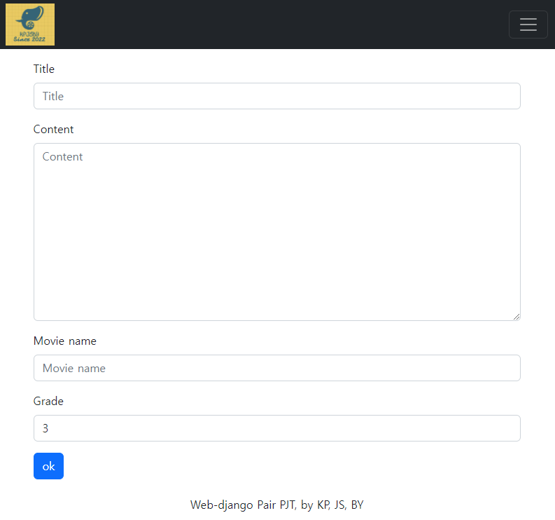

# Django Crud Pair Project

## Pair Project 후기

페어 프로젝트를 하며 내가 아는 것들을 알려주며 내 지식들을 더 확실하게 내 것으로 만들 수 있어 좋았다. 또한 git collaboration으로 실시간으로 푸쉬-풀을 반복하며 협업을 하니 확실히 협업하는 느낌이 났다.

## 영화 리뷰 사이트

### 기본 설정

### [base.html](./PJT/templates/base.html)


앞으로의 페이지들에 쓰일 베이스 템플릿.  네비게이션 바는 로고를 누를시 main페이지, 나머지 두 버튼을 누를 시 각각 해당하는 페이지로 이동한다.

#### 프로젝트 urls.py 설정

```python
from django.contrib import admin
from django.urls import path, include

urlpatterns = [
    path("admin/", admin.site.urls),
    path("", include("reviews.urls")),
]
```

한 프로젝트에 여러가지 앱이 있을 수 있으므로, include를 통해 각 앱의 urls를 다시 불러온다.

#### settings.py 설정

```python
INSTALLED_APPS = [
    "reviews", # reviews앱과 장고 부트스트랩을 추가해준다.
    "django_bootstrap5",
    "django.contrib.admin",
    "django.contrib.auth",
    "django.contrib.contenttypes",
    "django.contrib.sessions",
    "django.contrib.messages",
    "django.contrib.staticfiles",
]

TEMPLATES = [
    {
        "BACKEND": "django.template.backends.django.DjangoTemplates",
        "DIRS": [BASE_DIR / "templates"], # 베이스 템플릿 위치 설정
		...
}]
```


#### models.py설정

```python
from django.db import models

# Create your models here.

class Reviews(models.Model):
    title = models.CharField(max_length=20)
    content = models.TextField()
    movie_name = models.CharField(max_length=20)
    grade = models.IntegerField(default=3)
    created_at = models.DateTimeField(auto_now_add=True)
    updated_at = models.DateTimeField(auto_now=True)
```

모델 필드들을 부여한다.

#### forms.py

```python
from django.forms import ModelForm
from .models import Reviews


class ReviewForm(ModelForm):
    class Meta:
        model = Reviews
        fields = "__all__"
```

모델 폼을 만들어준다.

### urls.py

```python
from django.urls import path
from . import views

app_name = "reviews"

urlpatterns = [
]
```

app에 urls.py 파일 생성 및 설정

### static 설정

```python
#settings.py

STATICFILES_DIRS = [ # static 폴도 위치 설정
    BASE_DIR,
    "PJT/static",
]
```


static폴더 생성

### Main page


```python
#urls.py
path("", views.main, name="main")
#view.py
def main(request):
    return render(request, "reviews/main.html")
```

메인페이지 urls.py 및 view.py 설정

[main.html](./PJT/reviews/templates/reviews/main.html) 

## Crud

### Create



제목, 내용, 영화이름, 별점을 입력 할 수 있다. 별점은 최소 1점에서 최대 3점으로 제한된다.

```python
#urls.py
path("create/", views.create, name="create"),

#view.py
def create(request):
    if request.method == "POST":
        review_form = ReviewForm(request.POST)
        if review_form.is_valid():
            review_form.save()
            return redirect("reviews:index")
    else:
        review_form = ReviewForm()
    context = {
        "review_form": review_form,
    }
    return render(request, "reviews/create.html", context=context
                  
#forms.py 별점 1~5제한 css 먹이는 방법
from django.forms import ModelForm, NumberInput
from .models import Reviews

class ReviewForm(ModelForm):
    class Meta:
        model = Reviews
        fields = "__all__"
        widgets = {
            "grade": NumberInput(
                attrs={
                    "maxlength": "1",
                    "max": "5",
                    "min": "1",
                }
            ),
        }

```

[create.html](./PJT/reviews/templates/reviews/create.html)

### Read-index


```python
#urls.py
path("index/", views.index, name="index"),

#views.py
def index(request):
    reviews = Reviews.objects.all()
    context = {
        "reviews": reviews,
    }
    return render(request, "reviews/index.html", context)
```

[index.html](./PJT/reviews/templates/reviews/index.html)

별점은 템플릿에서 if문을 사용해 구현했다.

### Read-detail


```python
#urls.py
path("index/<int:pk>/", views.detail, name="detail")

#views.py
def detail(request, pk):
    review = Reviews.objects.get(pk=pk)
    context = {
        "review": review,
    }
    return render(request, "reviews/detail.html", context)
```

[detail.html](./PJT/reviews/templates/reviews/detail.html)

수정버튼, 삭제버튼을 통해 수정과 삭제를 할 수 있다.

### Update


```python
#urls.py
path("update/<int:pk>", views.update, name="update")

#views.py
def update(request, pk):
    review = Reviews.objects.get(pk=pk)
    if request.method == "POST":
        review_form = ReviewForm(request.POST, instance=review)
        if review_form.is_valid():
            review_form.save()
            return redirect("reviews:detail", review.pk)
    else:
        review_form = ReviewForm(instance=review)
    context = {
        "review_form": review_form,
        "review": review,
    }
    return render(request, "reviews/create.html", context)
```

템플릿은 create.html을 공유한다.

### Delete

```python
#urls.py
path("delete/<int:pk>/", views.delete, name="delete")

#views.py
def delete(request, pk):
    review = Reviews.objects.get(pk=pk)
    review.delete()
    return redirect("reviews:index")
```