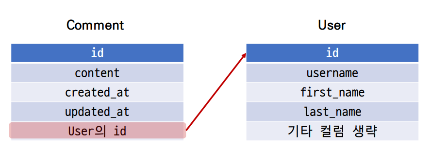

## 1:N (User - Comment)

* User(1) - Comment(N) 
* User 모델과 Comment 모델 간 관계 설정 
* “0개 이상의 댓글은 1개의 회원에 의해 작성 될 수 있음”

### 모델 관계 설정

* Comment와 User간 모델 관계 설정



* Comment 모델에 User 모델을 참조하는 외래 키 작성

```python
# articles/models.py
class Comment(models.Model):
    article = models.ForeignKey(Article, on_delete=models.CASCADE)
    user = models.ForeignKey(settings.AUTH_USER_MODEL, on_delete=models.CASCADE)
    ...
```

* Migration 진행
  * 첫번째 화면 
  * 기본적으로 모든 컬럼은 NOT NULL 제약조건이 있기 때문에 데이터가 없이는 새로 추가되는 외래 키 필드 user_id가 생성되지 않음 
  * 그래서 기본값을 어떻게 작성할 것인지 선택해야 함 
  * 1을 입력하고 Enter 진행 (다음 화면에서 직접 기본 값 입력)
* migrations 파일 생성 후 migrate 진행

### Create

* 인증된 회원의 댓글 작성 구현하기 
* 작성하기 전 로그인을 먼저 진행한 상태로 진행

#### CommentForm 

* CommentForm 출력을 확인해보면 create 템플릿에서 불필요한 필드(user)가 출력 됨 
* user 필드에 작성해야 하는 user 객체는 view 함수의 request 객체를 활용해야 함
* CommentForm의 출력 필드 수정

```python
# articles/forms.py
class CommentForm(forms.ModelForm):
    class Meta:
        model = Comment
        exclude = ('article', 'user',)
```

#### 외래 키 데이터 누락

* 댓글 작성 시 작성자 정보가 함께 저장될 수 있도록 save의 commit 옵션을 활용

```python
# articles/views.py
def comments_create(request, pk):
    article = Article.objects.get(pk=pk)
    comment_form = CommentForm(request.POST)
    if comment_form.is_valid():
        comment = comment_form.save(commit=False)
        comment.article = article
        comment.user = request.user
        comment.save()
    return redirect('articles:detail', article.pk)
```

### READ

#### 댓글 작성자 출력

* detail 템플릿에서 각 게시글의 작성자 출력

```django
<!-- articles/detail.html -->


...
    <h4>댓글 목록</h4>
    ...
    <ul>
        
        <li>
            {{ comment.user }} - {{ comment.content }}
            <form action="" method="POST">
            
                <input type="submit" value="DELETE">
            </form>
    ...
```

### DELETE

#### 댓글 삭제 시 작성자 확인

* 이제 댓글에는 작성자 정보가 함께 들어있기 때문에 현재 삭제를 요청하려는 사람과 댓글을 작성한 사람을 비교하여 본인의 댓글만 삭제 할 수 있도록 함

```python
# articles/views.py
def comments_delete(request, article_pk, comment_pk):
    comment = Comment.objects.get(pk=comment_pk)
    if request.user == comment.user:
    	comment.delete()
    return redirect('articles:detail', article_pk)

<!-- articles/detail.html -->


    ...
    <ul>
        
            <li>
            {{ comment.user }} - {{ comment.content }}
            
                <form action="" method="POST">
                    
                    <input type="submit" value="DELETE">
                </form>
            
    ...
```