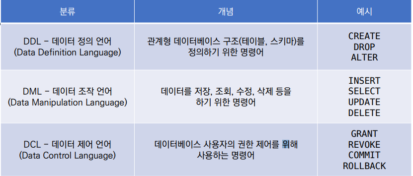

# Data base

* 체계화된 데이터의 모임
* 자료 항목의 중복을 없애고 자료를 구조화하여 기억시켜 놓은 자료의 집합체
* 장점
  * 중복 최소화, 무결성, 일관성, 독립성, 표준화, 보안 유지

## 관계형 데이터 베이스 (RDB, Relational Database)

* 서로 관련된 데이터를 저장하고 접근할 수 있는 데이터베이스 유형
* 키와 값들의 간단한 관계를 표 형태로 정리한 데이터베이스
* 스키마
  * 데이터베이스에서 자료의 구조, 표현방법, 관계 등 전반적인 명세를 기술
* 테이블
  * 열과 행의모델을 사용해 조직된 데이터 요소들의 집합

## RDBMS 관계형 데이터베이스 관리 시스템

* 관계형 모델을 기반으로 하는 데이터베이스 관리시스템을 의미
* SQLite
  * 서버 형태가 아닌 파일 형식으로 응용프로그램에 넣어서 사용하는 비교적 가벼운 데이터베이스
  * Data Typle
    * NULL
    * INTEGER : 크기에 따라 0, 1, 2, 3, 4, 6 또는 8바이트에 저장된 부호 있는 정수
    * REAL : 8바이트 부동 소수점 숫자로 저장된 부동 소수점 값
    * TEXT
    * BLOB : 입력된 그대로 정확히 저장된 데이터

## SQL (Structured Query Language)

* 관계형 데이터베이스 관리시스템의 데이터 관리를 위해 설계된 프로그래밍 언어
* 데이터베이스 스키마 생성 및 수정
* 자료의 검색 및 관리
* 데이터베이스 객체 접근 조정 관리



* SQL Keywords - Data Manipulation Language
  * INSERT : 새로운 데이터 삽입
  * SELECT : 저장되어있는 데이터 조회
  * UPDATE : 저장되어있는 데이터 갱신
  * DELETE : 저장되어있는 데이터 삭제

## Hello World!

* 데이터베이스 생성하기

  * ```sqlite
    sqlite3 tutorial.sqlite3
    sqlite> .database
    sqlite> .mode csv
    sqlite> .import hellodb.csv examples
    sqlite> .tables
    examples
    ```

  * [테이블 생성하고 지우기](./01_hello.sql)

  * [테이블 생성, 값 추가하고 읽기](./02_classmates.sql)

* 필드 제약 조건
  * NOT NULL : NULL 값 입력 금지
  * UNIQUE : 중복 값 입력 금지 (NULL값은 가능)
  * PRIMARY KEY : 테이블에서 반드시 하나. NOT NULL + UNIQUE
  * FOREIGN KEY : 외래키. 다른 테이블의 KEY
  * CHECK : 조건으로 설정된 값만 입력 허용
  * DEFAULT : 기본 설정 값
* READ
  * LIMIT : 쿼리에서 반환되는 행 수 제한
  * OFFSET : 특정 행부터 시작해서 조회
* WHERE
  * 쿼리에서 반환된 행에 대한 특정 검색 조건을 지정
* SELECT DISTINCT
  * 조회 결과에서 중복 행을 제거
  * DISTINCT 절은 SELECT 키워드 바로 뒤에 작성해야 함
* [필드 제약조건, row id, READ 사용](./03_classemates.sql)
* [건강검진 데이터를 활용한 실습](./prob.sql)