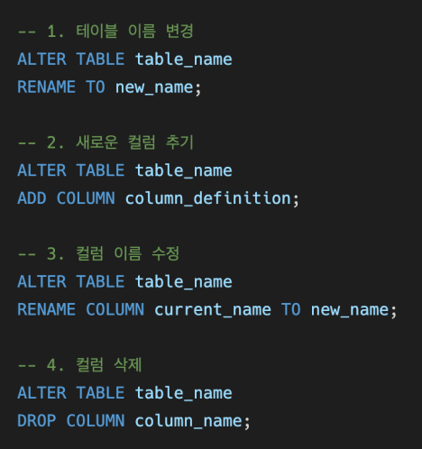

## 기본 함수와 연산

* 문자열 함수
  * SUBSTR(문자열, start, length) : 문자열 자르기 : 시작 인덱스1, 마지막 인덱스는 -1
  * TRIM(문자열), LTRIM(문자열), RTRIM(문자열) : 문자열 공백 제거
  * LENGTH(문자열) : 문자열 길이
  * REPLACE(문자열, 패턴, 변경값) : 패턴에 일치하는 부분을 변경
  * UPPER(문자열), LOWER(문자열) : 대소문자 변경
  * || : 문자열 합치기
* 숫자 함수
  * ABS(숫자)  : 절대 값
  * SIGN(숫자) : 부호(양수 1, 음수 -1, 0 0)
  * MOD(숫자1, 숫자2) : 숫자1을 숫자2로 나눈 나머지
  * CEIL(숫자), FLOOR(숫자), ROUND(숫자, 자리) : 올림, 내림, 반올림
  * POWER(숫자1, 숫자2) : 숫자1의 숫자2제곱
  * SQRT(숫자) : 제곱근
* [함수 사용 실습](./06_fuction.sql)
## GROUP BY

* Aggregate function (집계 함수) 다시보기

  * • 값 집합에 대한 계산을 수행하고 단일 값을 반환
  * SELECT 구문에서만 사용됨
  * 예시 : COUNT(*),  AVG(age)

* ALIAS : 칼럼명이나 테이블명이 너무 길거나 다른 명칭으로 확인하고 싶을 때는 ALIAS를 활용

  * AS를 생략하여 공백으로 표현할 수 있음

  * 별칭에 공백, 특수문자 등이 있는 경우 따옴표로 묶어서 표기

  * ```sqlite
    SELECT last_name 성 FROM users;
    SELECT last_name AS 성 FROM users;
    SELECT last_name AS 성 FROM users WHERE 성='김';
    ```

* GROUP BY

  * SELECT 문의 optional 절

  * 행 집합에서 요약 행 집합을 만듦

  * 선택된 행 그룹을 하나 이상의 열 값으로 요약 행으로 만듦

  * 문장에 WHERE 절이 포함된 경우 반드시 WHERE 절 뒤에 작성해야 함

  * ```sqlite
    SELECT * FROM 테이블이름 GROUP BY 컬럼1, 컬럼2;
    ```

  * GROUP BY절에 명시하지 않은 컬럼은 별도로 지정할 수 없음

  * GROUP BY의 결과는 정렬되지 않음

* HAVING

  * 집계함수는 WHERE 절의 조건식에서는 사용할 수 없음(실행 순서에 의해)
    * WHERE로 처리하는 것이 GROUP BY 그룹화보다 순서상 앞서 있기 때문
  * 집계 결과에서 조건에 맞는 값을 따로 활용하기 위해서 HAVING을 활용

* SELECT 문장 실행 순서

  * FROM => WHERE => GROUP BY => HAVING => SELECT => ORDER BY

    * ```sqlite
      SELECT 칼럼명
      FROM 테이블명
      WHERE 조건식
      GROUP BY 칼럼 혹은 표현식
      HAVING 그룹조건식
      ORDER BY 칼럼 혹은 표현식
      LIMIT 숫자 OFFSET 숫자;
      ```

## ALTER TABLE



* [GROUP BY, ALTER TABLE 실습](./07_group%26alter.sql)
